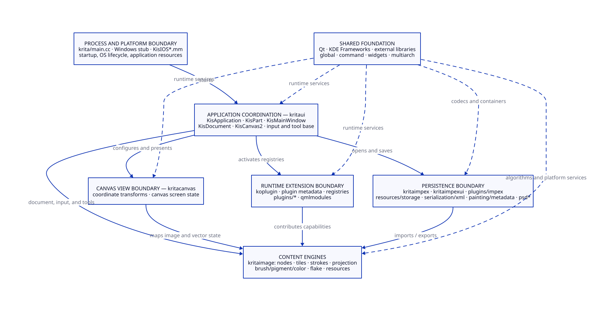
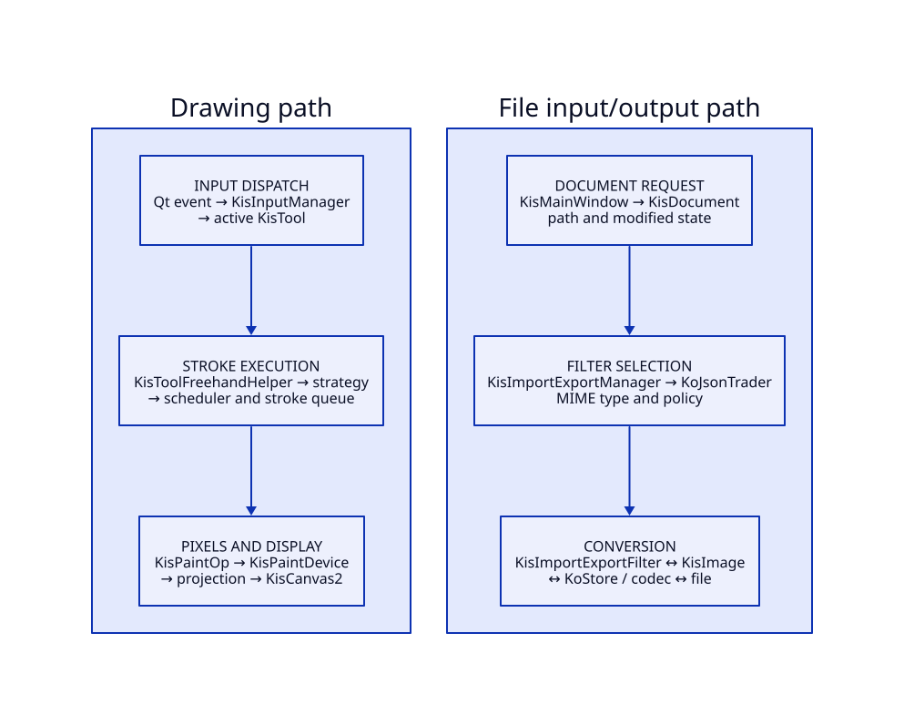
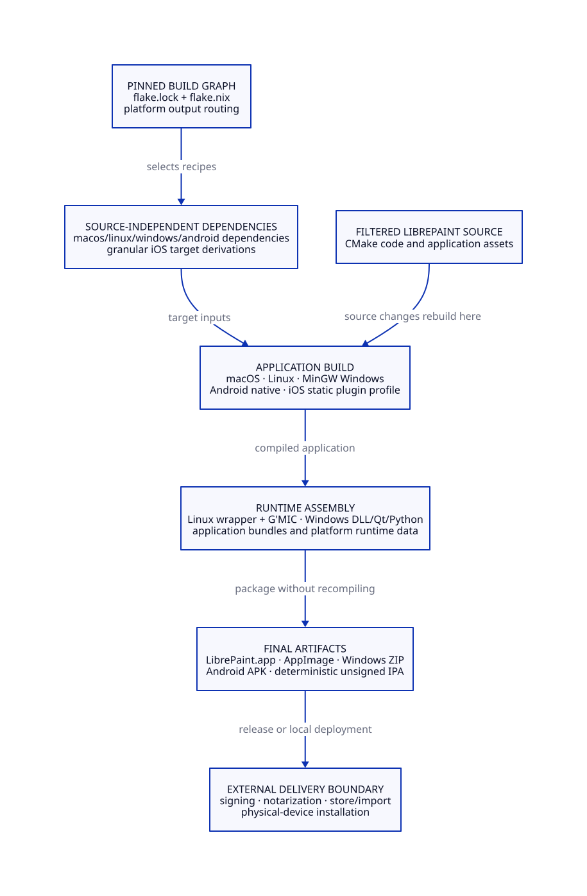

# LibrePaintアーキテクチャガイド

## 目的

この文書は、変更内容から調査対象を絞り、LibrePaintの主要な設計境界と実行経路を把握するための入口です。設計判断に使う責務、経路、識別子を中心にまとめています。

全プラットフォーム共通の長期改造計画は[LibrePaint全面改造TODO](TODO.md)で管理します。
開発・検証コマンドは[LibrePaint開発・検証基盤](DEVELOPMENT.md)、現在の再開地点は
[LibrePaintアーキテクチャ作業状況](PROGRESS.md)を正本とします。

- 変更を共通コード、プラグイン、プラットフォーム統合、配布定義のどこへ置くか
- 起動、描画、ファイル入出力がどの境界を通るか
- CMakeターゲット、実行時プラグイン、Nix出力の違い
- 調査時に最初に読むファイルと、その次に追う識別子

図は責務と主要な実行経路を示します。実際のリンク境界は各ディレクトリーの
`CMakeLists.txt`を正本とします。

## 最初の30分で読む順序

1. [ルートのCMakeLists.txt](../../CMakeLists.txt)末尾で、`libs`、`qmlmodules`、`plugins`、`krita`の構成順とiOS条件を確認します。
2. [libs/CMakeLists.txt](../../libs/CMakeLists.txt)と[plugins/CMakeLists.txt](../../plugins/CMakeLists.txt)で、常時リンクするライブラリーと機能単位のプラグインを分けます。
3. [krita/CMakeLists.txt](../../krita/CMakeLists.txt)で実行形式、Qtリソース、OS別ソース、静的プラグインの最終リンクを確認します。
4. [krita/main.cc](../../krita/main.cc)から`KisApplication::start()`を追い、[KisApplication.cpp](../../libs/application/ui/orchestration/KisApplication.cpp)でグローバル状態、プラグイン、リソース、メインウィンドウの初期化順を確認します。
5. [KisDocument.h](../../libs/ui/document/KisDocument.h)と[kis_image.h](../../libs/image/kis_image.h)を読み、文書の寿命・入出力と、画像モデル・描画スケジューラーを分けて捉えます。
6. 対象機能を[変更内容から見る場所](#変更内容から見る場所)で引き、近傍の`CMakeLists.txt`、プラグインJSON、テストまで範囲を広げます。
7. 配布や依存関係の変更では、[flake.nix](../../flake.nix)を入口に、該当する`nix/<platform>/`と`packaging/<platform>/`を読みます。

## 全体構造

図の編集元は[code-architecture.d2](code-architecture.d2)です。

### パッケージ境界

[パッケージ境界方針](package-boundaries.json)は、現在の10責務、27の中核所有ターゲット、
責務間で許可する直接リンク方向だけを保持する。所有ターゲットは一つの責務へ一意に属し、
許可方向は有向非巡回グラフを形成する。

| 責務ID | 中核所有ターゲット | 対象 |
| --- | --- | --- |
| `application-configuration` | `kritaapplication` | 設定値、スナップ方針、プラットフォームのファイル交換 |
| `application-orchestration` | `krita`、`kritaapplicationui` | 起動、OSライフサイクル、ウィンドウ、作業空間 |
| `canvas-presentation` | `kritabasicflakes`、`kritacanvas`、`kritaflake`、`kritaworkspacepresentation` | 座標変換、キャンバス、ベクター、作業空間表示 |
| `document-lifecycle` | `kritadocument`、`kritadocumentfiles`、`kritadocumentui` | 文書寿命、変更状態、保存、取り消し、文書表示 |
| `import-export` | `kritaimpex`、`kritaimpexui` | 形式選択、検証、文書入出力、結果通知 |
| `input-interpretation` | `kritainput`、`kritainputui` | ポインター、キーボード、タッチ、タブレット、ショートカット |
| `painting-rendering` | `kritacolor`、`kritaimage`、`kritalibbrush`、`kritapainting`、`kritapaintingmetadata`、`kritapaintingundo`、`kritapigment` | 色、ブラシ、画像、投影、ストローク、描画、メタデータ |
| `plugin-infrastructure` | `kritaplugin` | メタデータ探索、ファクトリーとサービス種別の登録 |
| `resource-management` | `kritaresources`、`kritaresourcestorage`、`kritaresourceui` | リソースの保存、検索、タグ、選択、表示 |
| `tool-invocation` | `kritatools`、`kritatoolsui` | ツール命令、描画設定表示、キャンバス状態への呼出し |

`scripts/architecture/check_package_boundaries.py`は、高速検査で方針の所有一意性、
参照整合性、許可方向の非循環性を検査する。各プラットフォームの
`build-incremental <platform> configure`はCMake File APIの問い合わせを構築木に作成し、
構成直後の応答から中核ターゲットの存在、実際の直接リンク方向、全製品ターゲットの循環を
検査する。実構成が正本であり、生成したターゲット台帳は保守しない。

### 公開ヘッダーとプラグイン登録

`scripts/architecture/check_public_contracts.py`は、製品ソースとCMake定義を毎回直接調べる。
所有パッケージの外から利用されるヘッダーには、所有ターゲットの公開マクロまたは公開ヘッダー
構築契約が必要である。

製品プラグインは登録マクロと兄弟JSONを一対一で持ち、IDが一意で、既知のサービス種別を
一つ宣言する。JSONのライブラリー名を所有ターゲットとして使用し、ライブラリー名を持たない
登録だけは検査器内の限定された所有上書きへ対応させる。登録実装、JSON、サービス種別、
CMake所有を変更したときは同じ直接検査で整合性を確認する。

### 責務別の所有先

現在の10責務は、所有ディレクトリー、公開APIの名前空間、主CMakeターゲットを次のように
対応付ける。新しい公開APIは対応する責務名前空間を使用し、所有ターゲットの公開面へ登録する。

| 責務 | 所有ディレクトリー | 新しいAPIの名前空間 | 主ターゲット |
| --- | --- | --- | --- |
| プラグイン基盤 | `libs/koplugin` | `Krita::Plugin` | `kritaplugin` |
| リソース管理 | `libs/resources` | `Krita::Resources` | `kritaresources` |
| 描画 | `libs/painting` | `Krita::Painting` | `kritapainting` |
| 入出力 | `libs/impex` | `Krita::ImportExport` | `kritaimpex` |
| キャンバス表示 | `libs/canvas` | `Krita::Canvas` | `kritacanvas` |
| 文書寿命 | `libs/document` | `Krita::Document` | `kritadocument` |
| ツール呼出し | `libs/tools` | `Krita::Tools` | `kritatools` |
| 入力解釈 | `libs/input` | `Krita::Input` | `kritainput` |
| アプリケーション設定 | `libs/application` | `Krita::ApplicationConfiguration` | `kritaapplication` |
| アプリケーション調整 | `libs/application/ui` | `Krita::Application` | `kritaapplicationui` |

パッケージ境界方針、実CMakeグラフ、公開契約の直接検査が、現在の所有、依存方向、
有向非巡回性、公開ヘッダー境界を継続して確認する。

`libs/ui/tool`の公開ヘッダーは、画面表示、入力、ストローク作成、描画実行を接続する
`kritaapplicationui`所有の実装である。ツール命令と設定値は`libs/tools`、設定表示は
`libs/tools/ui`が所有する。既存の公開大域C++識別子は確立済みのAPI・ABI名を維持し、
新しいAPIは上表の責務名前空間を使用する。`kritaapplicationui`が生成する
`KRITAUI_EXPORT`と生成ヘッダーの`kritaui`基底名は、既存ABIの公開名を維持する。

最初の実装段階R1-G6aは、`libs/store`の書庫保存を`libs/resources/storage`の
`kritaresourcestorage`へ、XML直列化を`libs/serialization/xml`の
`kritaxmlserialization`へ分け、`libs/resourcewidgets`を`libs/resources/ui`へ移す。
同時に`libs/ui`と`libs/ui/widgets`の描画設定表示を`libs/tools/ui`へ分離し、描画から
入出力2件、リソースから入出力5件、リソースから描画40件の逆方向includeをゼロにする。
保存領域の読込、書込、取消し、不正アーカイブ、リソース検索、表示接続の契約が、
この段階の着手条件と完了判定になる。

保存境界と表示境界は実装済みである。`kritaresourcestorage`がZIPとディレクトリーの保存契約を所有し、
`kritaxmlserialization`がXML名前空間と逐次書出しを所有する。実利用元は必要なターゲットへ
直接リンクする。`libs/store`、`kritastore`、転送ヘッダーは存在しない。対象構成の
CMake File API検査が保存ターゲットの存在と依存方向を継続確認する。両ターゲットは
LibrePaint内の上位製品ターゲットへ依存せず、保存側はQt Core、KConfig、QuaZip、XML側はQt Coreを
利用する。`kritaresourceui`は型付きリソース記述子と汎用の選択・タグ表示を所有し、
`kritatoolsui`はパレット、合成方法、プリセット、描画設定の表示を所有する。旧
`libs/resourcewidgets`、旧ターゲット、転送ヘッダーは存在しない。

R1-G6bは、`libs/ui/tool/strokes`を`libs/painting/strokes`へ移し、同じUIツール領域に
置かれていた資源スナップショット、非同期更新、互換性判定、速度計測を`libs/painting`へ
移した。`libs/command`の画像・キャンバス向け取り消し処理は`libs/painting/undo`へ、
`libs/metadata`の画像メタデータ実装は`libs/painting/metadata`へ移した。画像層から利用する
取り消し処理とメタデータをそれぞれ`kritapaintingundo`、`kritapaintingmetadata`とし、画像層を
利用するストローク実行を`kritapainting`とすることで、CMakeターゲットの循環を避けている。
資源スナップショットはUIの具体的な資源提供者ではなく、`libs/resources`が所有する読出し
接続面を保持する。旧ディレクトリーの転送ヘッダーと旧メタデータターゲットは存在しない。

R1-G6cは、`libs/ui/KisImportExportManager.*`、`KisImportExportFilter.*`、
`KisImportExportErrorCode.*`、`KisImportExportAdditionalChecks.*`、
`KisImportUserFeedbackInterface.*`を起点として分割した。形式探索、MIME選択、結果分類、
事前検査、変換フィルターは`libs/impex`の`kritaimpex`が所有する。文書変換の調整、
利用者通知、クリップボード、ダイアログ、画像読込補助は`libs/impex/ui`、動画符号化調整は
`libs/impex/animation`に置き、`kritaimpexui`が所有する。`kritaimpexui`は文書・画面型との
現在のABI接続を保つオブジェクト所有単位として`kritaapplicationui`へ組み込む。旧`libs/ui`の入出力ヘッダーと
転送ヘッダーは存在せず、利用元は正規の所有先を直接参照する。

R1-G6dの最初の独立単位は、`libs/ui/canvas/kis_coordinates_converter.*`と
`libs/ui/canvas/KisCanvasState.*`を起点として分割した。座標変換と画面状態は
`libs/canvas`の`kritacanvas`が所有し、`kritaapplicationui`は表示設定を明示的に渡して利用する。
座標変換器は構築元の画像を保持せず、構築時に取り込んだ幾何情報と変換結果を画像の
解放後も利用できる。旧配置と転送ヘッダーは存在せず、利用元と試験は新しい所有先を
直接参照する。

同段階の次の独立単位は、`libs/ui/canvas/kis_prescaled_projection.*`を起点として分割した。
表示用画像片、投影更新情報、投影取得接続面、拡大縮小済みフレームは`libs/canvas`の
`kritacanvas`が所有する。更新処理は画面設定やUI固有の表示フィルターを直接取得せず、
呼出し側が更新片の寸法、画面プロファイル、変換方法、画素フィルターを渡す。
`libs/ui/canvas/kis_qpainter_projection_factory.*`はUI設定と具体的な画像投影実装を
この接続面へ結び、`libs/ui/opengl/kis_opengl_update_info.*`はOpenGL固有の更新情報を
UI側に保持する。汚れ領域の更新通知と、空の更新では直前の有効フレームを保持する契約を
`libs/canvas/tests/kis_prescaled_projection_contract_test.*`が検査する。旧配置と転送
ヘッダーは存在しない。

表示色変換の独立単位は、`libs/ui/KisOcioConfiguration.*`、
`libs/ui/KisSurfaceColorSpaceWrapper.h`、`libs/ui/canvas/kis_display_color_converter.*`を
起点として分割した。表示色の設定値、Qt画面色空間との変換値、画素・画像の色変換本体、
表示フィルター接続面は`libs/canvas/color`の`kritacanvas`が所有する。
`libs/ui/canvas/kis_display_color_converter.*`はこの変換本体を保持し、現在ノード、設定通知、
前景色、画面パレットとの接続を担当する。UIをリンクしない色変換・色空間値契約と、
UI設定反映契約が同じ結果と通知回数を検査する。旧値型ファイルと転送ヘッダーは存在しない。

動画キャッシュの独立単位は、`libs/ui/kis_animation_frame_cache.*`、
`libs/ui/kis_animation_cache_populator.*`、`libs/ui/KisFrameDataSerializer.*`、
`libs/ui/KisFrameCacheStore.*`、`libs/ui/KisFrameCacheSwapper.*`を起点として分割した。
フレーム範囲の判定と変更指示、差分保存、ディスク直列化、タイル転送バッファーは
`libs/canvas/animation`と`libs/canvas/tiles`の`kritacanvas`が所有する。
`libs/ui/animation`は現在画像と再生状態、生成時機、設定変更を調整し、
`libs/ui/animation/cache`はOpenGL更新情報と保存値の変換を担当する。範囲管理、保存、
直列化はUI型を参照せずに構築・検査できる。旧配置と転送ヘッダーは存在しない。
`libs/ui/KisWidgetWithIdleTask.h`は表示部品として`libs/ui/canvas`へ移し、別ターゲットの
ドッカーが利用する公開ヘッダーを構築契約で固定した。

R1-G6eの最初の独立単位は、`libs/ui/kis_document_undo_store.*`を起点として文書全体への
参照を取り消し履歴の直接借用へ狭めた。R1-G6e-P1では、その接続を
`libs/document/undo/kis_document_undo_store.*`から
`libs/document/ui/undo/kis_document_undo_store.*`へ移し、履歴表示も
`libs/command/{kundo2model,kundo2view}.*`から同じ所有先へ集約した。
`kritadocumentui`が文書と履歴の接続、Qt Widgets用操作、履歴表示を所有し、`kritaapplicationui`が
直接利用する。汎用状態だけを持つ`kritadocument`は`kritapaintingundo`への依存を除去し、
Qt Coreだけで公開リンク閉包を構成する。履歴の現在位置、追加、取消し、マクロ、やり直し破棄、
同一スレッド上の同期通知、非所有の借用寿命に加え、操作名、有効状態、履歴行、選択による
履歴移動を専用契約で固定した。旧`kritacommand`、旧配置、転送ヘッダー、別名は存在しない。
同じ一括移設で`libs/ui/KisAutoSaveRecoveryDialog.*`を
`libs/document/ui/recovery/KisAutoSaveRecoveryDialog.*`へ移し、回復候補の初期選択と一括破棄を
文書UI契約として固定した。`KisDocument`状態へ直接依存してAPI再構築を要する文書情報編集と
保存処理は、機械的なファイル移動とは区別して後続の構造変更で扱う。

R1-G6eの第2の独立単位は、`libs/ui/KisDocument.cpp`に埋め込まれていた文書パス、
入出力実装へ渡す実ファイルパス、現在のMIME形式、自動判定由来を起点とする。
これらの文書識別状態は`libs/document/session/kis_document_identity.*`の
`Krita::Document::Identity`が所有し、`KisDocument`は既存APIとパス変更通知を接続する。
表示用パスと実ファイルパスを独立して保持し、同一パスの再設定では通知せず、文書の
スナップショットには識別状態を複製する。設定後に読み取られていなかった書出しMIME状態は
除去した。文書識別の実装はQt Core型だけを使用し、専用契約で検査できる。保存、
自動保存、回復のI/O調整は`KisDocument`に残る。

R1-G6eの第3の独立単位は、`libs/ui/KisDocument.cpp`に埋め込まれていた変更済み状態、
自動保存チェックポイント後の変更、保存実行中の変更、取り消し履歴に現れない画像変更を
起点とする。これらの文書変更状態は
`libs/document/session/kis_document_modification_state.*`の
`Krita::Document::ModificationState`が所有する。同じ変更済み値の再設定でも保存中と
自動保存後の変更を記録し、未変更への遷移では取り消し不能変更を消去する。保存用複製は
文書の変更状態を引き継ぎ、進行中の保存と自動保存の経過を初期化する。
`KisDocument`は編集時刻、文書情報更新、自動保存タイマー、Qt通知、保存・回復処理の
実行を接続し、既存の公開APIを維持する。変更状態の実装はQt型を使用せず、専用契約で
検査できる。`kritadocument`全体は取り消し履歴ライブラリーを通じてQt Widgetsへ依存するため、
Qt Widgets用アクション生成との分離要否はR1-G6eの後続単位で判定する。

R1-G6eの第4の独立単位は、`libs/ui/KisDocument.cpp`に埋め込まれていた自動保存用複製の
書出し状態と連続失敗回数を起点とする。これらの自動保存実行状態は
`libs/document/session/kis_document_autosave_state.*`の
`Krita::Document::AutoSaveState`が所有する。自動保存用複製の書出し開始から終了までを
明示し、3回の連続失敗後は次の試行で複製経路を選ぶ既存の境界値を保持する。通常間隔へ
戻ると失敗履歴を消去する。`KisDocument`はタイマー、設定、文書複製、ファイル出力、
利用者通知、回復調整を引き続き接続する。実行状態の実装はQt型を使用せず、専用契約で
検査できる。読み書きされていなかった旧失敗無視フラグは除去した。

R1-G6eの第5の独立単位は、`libs/ui/KisDocument.cpp`に埋め込まれていた回復用自動保存要求、
保存開始中に同期完了した場合の延期結果、既存の背景保存へ合流した場合の保存先を起点とする。
これらの要求調停状態は`libs/document/session/kis_document_recovery_autosave_state.*`の
`Krita::Document::RecoveryAutoSaveState`が所有する。未処理の要求だけが一度完了し、保存開始が
戻る前に届いた完了は開始結果が確定するまで延期する。既存の背景保存が利用可能な自動保存を
生成した場合は、その保存先を同じ回復要求へ引き継ぐ。`KisDocument`はタイマー、背景保存の
開始、変更状態、ファイルの存在と大きさの検証、完了通知を引き続き接続する。調停状態は
Qt Coreの値だけを使用し、専用契約で検査できる。

R1-G6eの第6の独立単位は、`libs/ui/KisDocument.cpp`に埋め込まれていた回復済み文書状態を
起点とする。この文書状態は`libs/document/session/kis_document_recovery_status.*`の
`Krita::Document::RecoveryStatus`が所有する。通常文書を初期状態とし、回復データから開いた
文書への遷移と通常保存後の復帰について、実際に値が変わる場合だけ通知が必要であることを
返す。`KisDocument`は回復データの探索と読込、保存後の回復ファイル消去、表示、
`sigRecoveredChanged`通知を引き続き接続する。保存用スナップショットは回復元の作業文書では
ないため、従来どおり通常文書状態から始まる。回復状態の実装はQt型を使用せず、専用契約で
検査できる。

R1-G6e開始時の`document-state`分類は25クラスであり、最初の分割後にUI所有の分類は
24クラスとなった。文書識別の抽出後も`KisDocument`自体はUI分類に残るため件数は24である。
変更状態、自動保存実行状態、回復用自動保存調停状態、回復済み文書状態の抽出も同じ
`KisDocument`内の埋込み状態を移すため、分類件数は24を維持する。
文書表示の集約と2つの画像ノード命令分離により、`KoDocumentInfo`、`KoDocumentInfoDlg`、
`KisNodeCommandsAdapter`、旧`KisNodeJugglerCompressed`（現`KisNodeOperationBatch`）が
UI分類から外れ、現在は20クラスである。
残る分類は文書寿命だけでなくノード操作、選択操作、表示モデルを含む。
後続単位では各クラスの実依存から文書状態、文書表示、別機能の操作接続を
判定し、文書寿命を所有するものだけを文書ターゲットへ移す。

R1-G6e後半は[文書パッケージ境界計画](document-package-boundary-plan.md)に従い、依存経路の
一方向化、具体的な命名、現存する関心領域ごとの分割と集約を行う。`kritadocument`は文書状態、
`kritadocumentfiles`は文書ファイル、バックアップ、自動保存ファイル、回復ファイル、
`kritadocumentui`はダイアログ、状態表示、文書情報編集、取り消し履歴との接続と表示を所有する。
形式処理と表示が共有する直列化対象の文書情報は`kritaimpex`が所有する。依存は文書UIから
文書ファイル保存、文書ファイル保存から文書状態と入出力へ向ける。

`kritadocumentui`の公開共有ライブラリーは、文書情報、入出力表示、自動保存回復、名前付き回復、
取り消し履歴という5つの内部オブジェクト所有単位を集約する。`kritaimpex`もファイル属性検査、
MIME集約とプラグイン探索、エラー表現、文書メタデータ、書き出し検査基底、組込み検査登録、
書き出し前検査を内部オブジェクト所有単位として集約する。実フィルター生成はフィルター本体と
同じ公開共有ライブラリーに残す。公開ライブラリー名とシンボル所有は維持し、責務別のCTestは
対応する内部実装だけを直接リンクする。文書UIの挙動契約を追加するときは、
`libs/document/ui/tests/CMakeLists.txt`の対応を保ち、一括した公開共有ライブラリーへのリンクへ
戻さない。
入出力エラー分類も`kis_import_export_error_code_test`がエラー表現の内部実装を直接検査し、
ファイル事前条件とMIME選択を扱う`TestImportExportBoundary`から独立して反復する。
書き出し検査基底は`kis_export_check_base_test`が画像実装を構築せずに識別子、対応水準、警告、
層単位属性、仮想呼出しと破棄を検査する。画像状態と全組込み登録を必要とする寸法・登録・
書き出し前分類は`kis_export_checks_test`へ集約し、画像依存を持つ対象だけで反復する。
`TestImportExportPublicHeaders`は保存領域とQt Testだけをリンクし、画像側の抽象ライターは
公開ヘッダー検索経路から構築する。ヘッダーの自己完結性だけを理由に画像実装をリンクしない。
`kis_store_paintdevice_writer_test`は同じ軽量境界でメモリー上の保存領域へ実データを書き、
画像実装を介さずに保存領域ライターの挙動を反復する。

最初の検査段階で、文書と取り消し履歴の接続および履歴表示を`kritadocumentui`へ移し、
`kritadocument`の公開リンク閉包をQt Coreだけへ縮小した。第2段階では
`libs/ui/KisDocument.cpp`の保存・読込ダイアログ、状態表示、Qt通知を
`libs/document/ui/io`へ、文書情報編集と名前付き自動保存回復ダイアログを
`libs/document/ui/info`と`libs/document/ui/recovery`へ集約した。`KoDocumentInfo`は
`libs/impex/metadata`へ移し、入出力が上位の文書寿命へ依存する辺を作らずに、文書状態を
明示値として受け取る。第3段階では`libs/ui/KisDocument.cpp`と自動保存回復UIにあった
保存先検査、バックアップ、自動保存名、回復候補の探索と読込、使用可否判定、消去を
`libs/document/files`へ集約した。文書UIは生成済みの回復候補値を表示し、形式選択と形式変換、
直列化、非同期保存は既存の入出力所有と文書調整に維持する。第4段階では残る22クラスを
文書構成、外部ファイル層、操作管理、ノード・選択操作接続、Qtモデルと表示状態へ分け、
`KisDocument.cpp`の130メソッド定義を8関心へ分類した。R1-G6e開始時の25クラスすべてが
具体的な所有先またはR1-G6f、R1-G6hを持つ。現在必要な保存I/O差し替え、複数実装、
利用事例登録、追加の純粋計算はなく、文書境界だけを理由とする抽象は追加しない。

ノード表示モデルは`KisNodeManager`と操作接続へ、外部ファイル層は`KisPart`へ直接依存する。
R1-G6fの最初の単位では、`libs/ui/kis_node_commands_adapter.*`を
`libs/image/commands/kis_node_commands_adapter.*`へ移し、ノード追加、移動、削除、属性変更の
取り消し可能な命令を既存の画像命令へ集約した。命令はUI全体ではなく操作対象画像を弱参照し、
長寿命の表示管理側が画面切替時に画像を明示的に結び直す。旧ファイル、転送ヘッダー、旧名の
別名は存在しない。入出力、文書、アプリケーション、ツールが同じ命令を利用しているため、
上位のツール所有へ置かず、既存の許可方向に従って画像命令を所有先とする。

次の単位では、`libs/ui/kis_node_juggler_compressed.*`を
`libs/image/commands/kis_node_operation_batch.*`へ移し、ノードの連続した追加、移動、複製、
削除と一つの取り消し履歴項目への集約を画像所有へ置いた。画像処理が借用していた
`KisNodeManager`は除去し、選択復元に必要なアクティブノードを呼出し側が値として渡す。
操作バッチの寿命構成と利用者操作の配線は`KisNodeManager`に残る。旧ファイル、転送ヘッダー、
旧名の別名は存在せず、新しい汎用層も追加していない。

`KisNodeManager`から画像ノードを変更する場合、移動可能性と選択マスクのアクティブ状態は
`KisNodeCommandsAdapter`が保証する。ミラー処理の再帰範囲、選択範囲、全フレーム処理、並行
ジョブ、取り消し履歴への登録は`KisMirrorProcessingVisitor::applyToNodes()`が構成する。
`KisNodeManager`は編集可否を利用者へ通知し、これらの画像処理を呼び出し、完了後の画面更新を
通知する。

クイックグループ化と解除の画像グラフ変更は
`libs/image/commands/kis_node_operation_batch.*`と`kis_node_group_operations.*`が所有する。
`KisNodeManager`は操作名、編集可否、選択更新、互換性エラーの表示だけを所有し、同ファイルは
1798行から1739行へ縮小した。

R1-G6fのツール命令単位では、`libs/ui/tool`にあった基底ツール、起動方針、変更追跡、
ファクトリー、平滑化設定、共通値処理を`libs/tools`へ移し、`kritatools`として独立構築する。
キャンバス操作の借用契約は`libs/canvas/KisToolCanvas.h`を`kritacanvas`が所有し、依存方向を
`kritatools`から`kritacanvas`へ固定する。画面固有の浮動メッセージと図形選択は
`libs/ui/tool/kis_tool_canvas_utils.*`、`KisCanvas2`との接続は
`libs/ui/canvas/kis_canvas_tool_support.cpp`が所有する。旧配置の転送ヘッダーは存在しない。

委譲ツールの入力フィルター接続と選択ツールの操作状態は`libs/tools`が所有する。
`libs/ui/tool/kis_delegated_tool.h`は`libs/tools/kis_delegated_tool.h`へ移し、
`libs/ui/tool/kis_tool_select_base.h`は操作を持つ`libs/tools/kis_tool_select_base.h`と、設定表示を
持つ`libs/ui/tool/kis_tool_select_ui_base.h`へ分けた。修飾キー対応は
`plugins/tools/selectiontools/kis_selection_modifier_mapper.*`から
`libs/tools/kis_selection_modifier_mapping.*`へ移し、設定値をキャンバス借用契約から渡す。
旧配置、転送ヘッダー、大域的な設定監視オブジェクトは存在しない。

描画ツールの操作状態は`libs/tools/kis_tool_paint_interaction.{h,cpp}`が所有する。
`libs/ui/tool/kis_tool_paint.{h,cc}`からポインター追跡、ブラシ寸法・回転操作、輪郭状態、
輪郭生成を移し、UI側には色採取、ポップアップ、設定部品、設定に基づく輪郭表示、描画補助線の
更新を残した。`kritatools`から`kritaapplicationui`への依存はなく、UI側が操作基盤を継承する方向となる。

図形を描画装置へ反映する実行は`kritapainting`が所有する。
`libs/ui/tool/kis_figure_painting_tool_helper.{h,cpp}`を
`libs/painting/kis_figure_painting_stroke.{h,cpp}`へ移し、一つの描画ストロークの開始、ジョブ追加、
終了を`KisFigurePaintingStroke`の寿命へまとめた。`libs/tools/KisToolShapeUtils.h`の描線・塗り値は
`libs/painting/KisFigurePaintingOptions.h`へ移し、空だった同名実装ファイルを除去した。
列挙値の順序とスクリプトのスタイル名対応は維持し、旧配置、転送ヘッダー、旧名の別名は存在しない。

矩形ツールの制約、修飾キー、ドラッグ座標、回転角と矩形計算は
`libs/tools/kis_rectangle_interaction.{h,cpp}`が所有する。
`libs/ui/tool/kis_tool_rectangle_base.{h,cpp}`にはポインター座標変換、編集可否の通知、寸法と位置の
表示、輪郭描画、キャンバス更新、設定部品を残した。矩形、楕円、矩形選択、矩形囲み塗りは同じ
操作状態を使用し、制約、固定寸法、正方形化、移動、中央拡張、回転の座標契約を
`TestToolCoreContract`が固定する。

自由形状ツールの点列、入力中状態、Controlによる継続入力、継続点の取り消し、完了と取消しは
`libs/tools/kis_outline_interaction.{h,cpp}`が所有する。
`libs/ui/tool/KisToolOutlineBase.{h,cpp}`には入力座標変換、編集可否の通知、輪郭表示、再描画範囲、
入力フィルターと操作アクションの接続を残した。自由選択と囲み塗りは同じ操作状態を使用し、通常入力、
継続入力、点の取り消し、完了、取消しの契約を`TestToolCoreContract`が固定する。

多角線ツールの点列、ドラッグ区間、閉路状態、点の取り消し、完了と取消しは
`libs/tools/kis_polyline_interaction.{h,cpp}`が所有する。
`libs/ui/tool/kis_tool_polyline_base.{h,cpp}`にはポインター座標変換、画面距離による始点スナップ判定、
輪郭表示、再描画範囲、右クリックと操作アクションの接続を残した。多角形、多角線、多角形選択は
同じ操作状態を使用し、単一点終了、複数点、閉路、点の取り消し、全取消しの契約を
`TestToolCoreContract`が固定する。

描画入力値の決定は`kritatools`が所有する。開始元の
`libs/ui/tool/kis_speed_smoother.{h,cpp}`は`libs/tools/kis_speed_smoother.{h,cpp}`へ移した。
`libs/ui/tool/kis_painting_information_builder.{h,cpp}`の圧力曲線、速度、傾き、時刻、キャンバス状態の
組立ては`libs/tools/kis_painting_information_builder.{h,cpp}`へ、座標変換と自由描画ツールへの接続は
`libs/ui/tool/kis_painting_information_builder_adapters.{h,cpp}`へ分けた。UI設定は
`libs/ui/tool/kis_painting_information_builder_config_p.h`の内部接続から値として中核へ渡す。
旧配置と転送ヘッダーは存在せず、設定変更通知、座標変換、圧力曲線、決定論的な速度平滑化、
キャンバス回転・反転、傾き補正の契約を維持する。

選択設定表示は`kritatoolsui`が所有する。`libs/ui/widgets/kis_selection_options.{h,cc}`と
`libs/ui/tool/kis_selection_tool_config_widget_helper.{h,cpp}`を同名の`libs/tools/ui`へ移した。
依存していた`libs/ui/widgets/kis_color_label_button.{h,cpp}`と
`libs/ui/widgets/kis_color_label_selector_widget.{h,cpp}`は汎用表示部品として`libs/widgets`へ移し、
レイヤーツリーの配色所有者を`kritaapplicationui`へ残した。選択方式、結合方法、アンチエイリアス、拡張、
境界停止、ぼかし、参照レイヤー、色ラベルの保存と再読込は`TestToolSettingsUiContract`が固定する。

ツール設定ポップアップは`kritatoolsui`が所有する。開始元の
`libs/ui/widgets/kis_tool_options_popup.{h,cpp}`を同名の`libs/tools/ui`へ移し、設定部品の見出し、区切り、
並び替え、退避を下位UIだけで構築できるようにした。ドック用フォントは`libs/ui/tool/kis_paintop_box.cc`が
値として渡し、ポップアップボタン、キャンバス、操作アクションとの接続は`kritaapplicationui`に残る。

矩形制約表示は`kritatoolsui`が所有する。開始元の
`libs/ui/tool/kis_rectangle_constraint_widget.{h,cpp}`と`libs/ui/forms/wdgrectangleconstraints.ui`を
同名の`libs/tools/ui`へ移し、ウィジェットは設定グループを受け取って制約値と角丸値を信号で返す。
`libs/ui/tool/kis_tool_rectangle_base.cpp`が矩形状態、設定再読込、制約適用を接続し、下位UIは矩形ツールを
参照しない。必要な汎用比率ロックは`libs/ui/kis_aspect_ratio_locker.{h,cpp}`から同名の`libs/widgets`へ
移し、画像寸法、フィルター、描画設定の既存利用元も`kritawidgets`の公開面を使う。

基本図形生成は`kritaflake`が所有する。開始元の`libs/ui/tool/kis_shape_tool_helper.{h,cpp}`を
`libs/flake/KoBasicShapeFactory.{h,cpp}`へ移し、矩形と楕円は登録済み図形ファクトリーを優先して生成し、
対応するプラグインがない構成では同じ境界矩形を持つパス図形を生成する。基本図形ツールと選択ツールは
`kritaflake`へ直接依存し、旧UI補助クラスと転送ヘッダーは存在しない。

入力の実時間標本化と遅延描画キューは`kritatools`が所有する。開始元の
`libs/ui/tool/kis_stabilized_events_sampler.{h,cpp}`と
`libs/ui/tool/KisStabilizerDelayedPaintHelper.{h,cpp}`を同名の`libs/tools`へ移し、標本化試験も
`libs/ui/tests`から`libs/tools/tests`へ移した。`libs/ui/tool/kis_tool_freehand_helper.cpp`は自由描画線の生成と
輪郭更新をコールバックで接続する。旧UI配置と転送ヘッダーは存在しない。

色採取ストロークの実行は`kritapainting`が所有する。開始元の
`libs/ui/tool/KisAsyncColorSamplerHelper.{h,cpp}`から、ストローク開始、採取ジョブ投入、完了ジョブと
終了処理を`libs/painting/KisColorSamplerStroke.{h,cpp}`へ分離した。UI補助クラスには採取対象の解決、
参照画像の優先、キャンバス色資源、カーソル、プレビュー配置と描画を残す。描画側の契約試験は、
採取ジョブの後に完了ジョブとストローク終了が並び、最後の採取色を一度だけ確定通知することを固定する。
旧`libs/painting/strokes/kis_color_sampler_stroke_strategy.h`は公開記号を除去し、描画パッケージの内部実装とする。

R1-G6fの完了監査では、分類済み22クラスの移設とツール所有に割り当てた17件のUI内部参照除去を
照合した。残る15クラスは入力解釈、ストローク生成、描画実行、表示接続の後続所有へ分類され、
ツール命令所有境界の完了条件を満たす。

R1-G6gの最初の単位では、`libs/ui/input`のショートカット照合、単発入力、ストローク入力、
タッチ・ネイティブジェスチャー判定を`libs/input`の`kritainput`へ移した。入力パッケージは
`KisInputAction`を借用して命令を通知し、入力管理器が所有する内部委譲オブジェクトが既存の
`KisAbstractInputAction`へ接続する。公開UI基底の継承構造と仮想関数表は維持する。
タッチ設定の列挙変換と設定読込はUI接続に残り、入力パッケージは正規化済みのジェスチャー種別と
タッチ描画状態の問い合わせだけを受け取る。マウス入力の順序、フォーカス喪失時の取消し、
入力アクション群マスクの復旧は`TestInputShortcutMatcher`が独立して固定する。

入力プロファイルの永続値は`kritainput`が所有する。開始元の
`libs/ui/input/kis_input_profile.{h,cpp}`を`libs/input/kis_input_profile.{h,cpp}`へ移し、
`libs/ui/input/kis_shortcut_configuration.{h,cpp}`は、直列化される入力値を
`libs/input/kis_shortcut_configuration.{h,cpp}`へ、翻訳済み表示文字列を
`libs/ui/input/kis_shortcut_configuration_text.{h,cpp}`へ分けた。ショートカットはUIアクションの
借用ポインターではなく安定識別子を保持し、UIのプロファイル管理器が表示と照合器への登録時だけ
具体アクションへ解決する。保存形式と表示文言は維持され、`TestInputProfile`が固定保存列、往復、
識別子索引を検査する。

合成入力の抑止状態と判定は、`libs/ui/input/kis_input_manager_p.{h,cpp}`の内部`EventEater`から
`libs/input/KisInputEventSuppressor.{h,cpp}`へ移した。入力パッケージは正規化済みの事象種別、
ボタン種別、合成元情報から、連続マウス抑止、遅延左クリック1回、右・中ボタン代替、タッチ開始の
抑止理由を決定する。UI入力管理器は設定値とプラットフォーム能力を構築時に渡し、Qt事象の正規化、
タブレット診断、`TouchBegin`の無視、事象フィルター接続を維持する。既存のQt事象伝播、macOSの
合成事象条件、Windowsの実行中ストローク保護は維持され、`TestInputEventSuppressor`がマウス、
タブレット、タッチ列を入力パッケージ単独で固定する。

入力のQt事象接続、設定表示、診断、プラットフォーム統合は`libs/input/ui`が所有する。
`kritainputui`はmacOS、Linux、Android、Windowsで共有ライブラリー、iOSで製品へ静的統合する
ライブラリーとして入力UIを一単位で構築する。公開クラスは`KRITAINPUTUI_EXPORT`を使い、利用元は
`input/ui/...`の公開include経路と`kritainputui`への直接リンクを持つ。`kritaapplicationui`は
アプリケーション入力アクションとの接続に同ライブラリーを利用し、`libs/input/ui/tests`が
入力管理の統合契約を検査する。

R1-G6hは、アプリケーション設定、プロセス調整、作業空間、プラットフォーム接続を
次の開始位置から正規所有先へ移した。

- `libs/ui/application/kis_config.{h,cc}`から`libs/application/kis_config.{h,cc}`へ移した。
- `libs/ui/canvas/kis_snap_config.{h,cpp}`から`libs/application/kis_snap_config.{h,cpp}`へ移した。
- `libs/ui/application/KisAndroidFileProxy.{h,cpp}`から
  `libs/application/platform-adapters/KisAndroidFileProxy.{h,cpp}`へ移した。
- `libs/ui/application`の残る18ファイルを`libs/application/ui/orchestration`へ移した。
- `libs/ui/workspace`の43ファイルを`libs/application/ui/workspace`へ移した。

`kritaapplication`は設定、スナップ方針、プラットフォームのファイル交換を所有する。
`kritaapplicationui`はアプリケーション調整と既存UI実装を所有し、macOS、Linux、Android、
Windowsでは共有ライブラリー、iOSでは静的ライブラリーとして構築する。
`kritaapplicationui`から`kritaapplication`への直接依存を5構成で持ち、逆方向依存と循環は0件である。

`libs/ui`のrootは`CMakeLists.txt`と`kritaui_export_instance.h`を持つ。CMake定義は現在の
`kritaapplicationui`へのソース、生成UI、条件付き実装の登録を所有し、公開記号設定ヘッダーは
同ライブラリーのテンプレート記号設定を所有する。
入出力表示は`impex`、Qt事象接続は`events`、フォントと配色は`theme`、macOS接続と資産は
`platform`、資源表示は`resources`、図形選択接続は`flake`、履歴アクション接続は`actions`に
配置する。公開ヘッダーの利用元は責務別の入れ子経路を使い、各翻訳単位とUI資産は
`kritaapplicationui`のCMake定義へ接続する。

共有ライブラリー記号を宣言しない別名、列挙、テンプレートを含む`kritaimage`の29ヘッダーは、
`libs/painting/tests/TestPublicImageHeaders.cpp`で一つの翻訳単位として構築する。この構築契約を
公開根拠として直接検査し、公開面を宣言せずに利用される内部ヘッダーとは区別する。

依存検査は10責務と5構成の現行ターゲットから、
逆方向依存、未確定射影、循環、内部参照が各0件であることを直接確認する。

メインウィンドウの画像状態操作は、次の開始箇所と具体所有へ接続する。

- `libs/application/ui/workspace/KisMainWindow.cpp`の画像設定通知から
  `libs/ui/dialogs/KisDlgPreferencesNotifications.cpp`の設定確定通知。
- 同ファイルのルートノード設定更新とノード選択アクション生成から
  `libs/ui/nodes/KisNodeManagerImageState.cpp`の現在画像を受け取るノード表示操作。
- 同ファイルの画像名、アニメーション範囲とフレーム率、投影更新待機から
  `libs/ui/document/KisDocumentImageState.cpp`の文書画像状態操作。
- 同ファイルの直前のアニメーション書出し設定読込から
  `libs/impex/animation/KisAnimationRenderingOptions.cpp`の保存済み設定読込。

設定変更通知、全ビューの走査条件、ノードアクション順、動画取込時の診断と範囲更新条件、
投影完了待機、描画再実行の設定キーを維持する。clangd監査で直接利用0件を確認した
`KisMainWindow.cpp`の`krita_utils.h`を除去し、同ファイルから描画所有ヘッダー6件への
直接経路を解消する。

作業ビューの画像状態接続とドロップ編集は、次の開始箇所と具体所有へ接続する。

- `libs/application/ui/workspace/KisView.cpp`の画像信号接続、表示準備、浮動小数点色深度判定から
  `libs/ui/canvas/KisCanvasImageState.cpp`と`libs/ui/canvas/kis_canvas2.h`のキャンバス画像状態。
- 同ファイルの色ドロップルーティングから
  `libs/ui/canvas/KisCanvasColorDrop.cpp`の塗りつぶしストローク。
- 同ファイルの内部ノード、画像、URL、参照画像のドロップ処理から
  `libs/ui/document/KisImageManagerDrop.cpp`と`libs/ui/document/kis_image_manager.{h,cc}`の
  文書画像取込操作。
- 同ファイルの現在レイヤー、マスク、選択範囲、ノード除去後の選択先取得から
  `libs/ui/nodes/KisNodeManagerImageState.cpp`のノード・選択状態。
- 同ファイルの画像メモリー統計取得と更新通知接続から
  `libs/ui/document/KisDocumentImageState.cpp`の文書画像状態。

ドロップ操作の選択肢、修飾キー、塗りつぶしジョブと取り消し命令の順序、画像とノードの
共有寿命、ノード通知の直接接続、表示開始時の画像信号接続順、文書タイトルのメモリー表示を
維持する。作業ビューのアプリケーション調整から描画への直接include 16件を解消する。

作業ビュー管理の画像・資源状態は、次の開始箇所と具体所有へ接続する。

- `libs/application/ui/workspace/KisViewManager.cpp`のキャンバス資源変換器、更新仲介、活動資源依存の
  初期化から`libs/ui/canvas/kis_canvas_resource_provider.{h,cpp}`の資源管理初期化。
- 同ファイルの画像進捗表示登録、画像取り消し接続取得、読取障壁ロック中の文書複製から
  `libs/ui/document/KisDocument.h`と`libs/ui/document/KisDocumentImageState.cpp`の文書画像状態。
- 同ファイルの活動ノード動画判定と活動レイヤー選択マスク編集可否判定から
  `libs/ui/nodes/kis_node_manager.h`と`libs/ui/nodes/KisNodeManagerImageState.cpp`のノード・選択状態。

資源変換器と依存の登録順、進捗表示の借用寿命、画像信号接続順、複製前の操作完了待機、
読取障壁ロック、文書保管場所の作成、取り消し接続、活動選択の判定を維持する。作業ビュー管理の
アプリケーション調整から描画への直接include 10件を解消する。

起動資源登録と共有監視は、次の開始箇所と具体所有へ接続する。

- `libs/application/ui/orchestration/KisApplication.cpp`のペイントプリセットとブラシローダー登録から
  `libs/ui/canvas/kis_canvas_resource_provider.{h,cpp}`の組込み描画資源登録。
- 同ファイルのPSDレイヤースタイルローダー登録から
  `libs/ui/canvas/kis_canvas_resource_provider.{h,cpp}`のレイヤースタイル資源登録。
- 同ファイルのブラシメタデータ修復登録から
  `libs/ui/canvas/kis_canvas_resource_provider.{h,cpp}`のブラシキャッシュ修復登録。
- `libs/application/ui/orchestration/KisPart.cpp`のシステム色管理初期化から
  `libs/ui/canvas/KisDisplayConfig.{h,cpp}`の表示色管理初期化。
- 同ファイルのアプリケーション単位アイドル監視から
  `libs/ui/animation/kis_animation_cache_populator.{h,cpp}`の文書画像追跡とキャッシュ生成通知。

組込みローダーと修復処理の登録位置、資源種別、MIME型、優先度、色管理singletonの生成時機、
アイドル監視の生成・破棄順、文書画像追跡、メモリー統計通知、公開監視ポインターを維持する。
アプリケーション調整から描画への直接include 5件を解消する。

責務の中心は次の五つです。

- `krita/`はプロセスの入口、アプリケーション資産、OSライフサイクルとの接続を持ちます。主要機能は`libs/`と`plugins/`が所有します。
- `libs/input`の`kritainput`と`kritainputui`は入力列の解釈、Qt接続、設定表示、プラットフォーム統合をまとめます。
- `libs/application/ui`の`kritaapplicationui`はアプリケーション、ウィンドウ、文書、キャンバス、ツール共通部をまとめます。
- `libs/impex`の`kritaimpex`と`kritaimpexui`は形式契約、文書入出力、利用者通知をまとめます。
- `libs/image`の`kritaimage`はレイヤーツリー、ペイントデバイス、タイル、ストロークキュー、投影更新を扱います。
- `plugins/`はツール、ブラシエンジン、フィルター、ドッカー、ファイル形式などの機能をレジストリーへ登録します。

`libs/ui`は画面機能と、`KisDocument`、ツール共通処理などのアプリケーション調整を
扱います。入出力管理は`libs/impex`に置き、`KisImage`は画像内容と非同期処理を中心に扱い、
ウィンドウとファイル名は`libs/ui`側が所有します。

## 主要な設計境界

### プロセス入口とアプリケーション初期化

通常のOSでは[krita/main.cc](../../krita/main.cc)の`main`が入口です。Windowsでは[krita/windows_stub_main.cpp](../../krita/windows_stub_main.cpp)の小さな実行形式が、共有ライブラリー側の`krita_main`を呼びます。`krita_main`の実装本体はどちらも`main.cc`です。

`KisApplication::start()`は、おおむね次の順で初期化します。

1. グローバルなファクトリーと設定
2. リソース型
3. プラグインが登録する各レジストリー
4. リソースデータベースと同梱リソース
5. `KisPart`、セッション、`KisMainWindow`
6. 自動保存の復旧と起動引数の文書

iOSのライフサイクル、メモリー警告、Pencilダブルタップは`KisIOS*.mm`から`main.cc`へ通知されます。タッチ向け画面は[plugins/extensions/iostouchui](../../plugins/extensions/iostouchui)にあり、OS通知の橋渡しと画面機能を分離しています。

### 文書と画像モデル

`KisDocument`は文書識別と変更状態の公開API、通知、自動保存、読み込み・保存、
`KisImage`の差し替えを調整します。識別値は`Krita::Document::Identity`、変更状態は
`Krita::Document::ModificationState`が所有します。`KisImage`は次を所有します。

- `KisNode`を基底とするレイヤー・マスクのツリー
- `KisPaintDevice`と`tiles3/`の画素タイル
- 合成結果である投影
- `KisUpdateScheduler`、`KisStrokesQueue`、更新キュー
- アンドゥ可能なストロークと画像変更通知

画像状態だけで完結する処理は`libs/image`側、ファイル名やダイアログ、
ウィンドウと連携する処理は`libs/ui`側から検討します。

### プラグインとレジストリー

プラグインはJSONメタデータのサービス種別、ID、対応MIME型などで発見され、コンストラクターからレジストリーへファクトリーを登録します。[KoJsonTrader.cpp](../../libs/koplugin/KoJsonTrader.cpp)が候補を列挙し、[KoPluginLoader.cpp](../../libs/koplugin/KoPluginLoader.cpp)が重複版と無効化設定を処理します。

デスクトップでは`lib/kritaplugins`などから動的に読み込みます。iOSでは
`kis_add_library`が`MODULE`を静的ライブラリーへ変換し、
`krita_ios_target_static_plugins`が実行形式へ登録・リンクします。組み込む対象の
正本は[initial-plugin-profile.json](../../packaging/ios/manifests/initial-plugin-profile.json)です。

機能を追加するときは、C++クラスと次の識別子を一組として確認します。

- 近傍の`CMakeLists.txt`にあるターゲット名
- `K_PLUGIN_FACTORY_WITH_JSON`などが参照するJSON
- `Id`、`X-KDE-ServiceTypes`、MIME型
- アクションIDと`*.action`／XMLGUI定義
- iOSへ含める場合は静的プラグインプロファイル

### Qtリソースとインストール資産

[krita/krita.qrc](../../krita/krita.qrc)は、`kritarc`と`krita5.xmlgui`をQtリソースへ割り当てる小さな目録です。アプリ全体のQtリソース一覧は[krita/CMakeLists.txt](../../krita/CMakeLists.txt)の`krita_QRCS`にあります。アイコン、シェーダー、カーソル、スプラッシュ、既定プリセットなどはそこから実行形式へ組み込まれます。

`install(FILES|DIRECTORY ...)`で配置する資産はQtリソースとは別です。特に`krita/data`、`pics`、`po`、プラグインJSON、バンドル資産を変更するときは、実行時参照方法がリソースURLかインストール先パスかを先に確認します。

## 実行時の主要経路

図の編集元は[runtime-paths.d2](runtime-paths.d2)です。

### 描画

自由描画を追う場合の基準経路は次のとおりです。

1. Qtのポインター／タブレット／タッチイベントを`KisInputManager`がショートカットと入力アクションへ振り分けます。
2. `KisToolInvocationAction`と`KoToolManager`が現在のツールへイベントを渡します。
3. `KisToolFreehand`と`KisToolFreehandHelper`が入力点、筆圧、傾き、プリセットの状態を`FreehandStrokeStrategy`のジョブへ変換します。
4. `KisImage::startStroke/addJob/endStroke`が`KisUpdateScheduler`と`KisStrokesQueue`へ処理を渡します。
5. 選択中の`KisPaintOp`が`KisPaintDevice`のタイルを更新します。
6. dirty領域から投影更新が計画され、`KisCanvas2`へ更新通知が戻ります。

入力の不具合はイベント受信から、ブラシ結果の不具合は`KisPaintOp`から、並列実行・アンドゥ・再描画の不具合はストローク戦略とスケジューラーから調べます。

R2では、この経路を次の観測可能な契約へ分けます。

| 段階 | 所有者と主要分岐 | 観測する状態と不変条件 | 現在の契約検査 |
| --- | --- | --- | --- |
| 入力受信と照合 | `libs/input`、`libs/input/ui`。マウス、タブレット、タッチ、ネイティブジェスチャー、合成マウス事象の抑止へ分岐する。 | 入力列、選択したアクション、開始・継続・終了・取消し、フォーカス喪失後の状態、アクション群マスクを観測する。一つの物理入力列から有効な命令列を一つ生成し、終了後に照合状態を残さない。 | `TestInputShortcutMatcher`、`TestInputEventSuppressor` |
| ツール呼出しと描画入力値 | `libs/tools`、`libs/ui/tool`。平滑化なし、基本平滑化、加重平滑化、安定化、遅延描画へ分岐する。 | 座標、筆圧、傾き、回転、速度、時刻、入力順、完了と取消しを観測する。正規化済み入力値と順序をストローク生成まで保持する。 | `TestToolCoreContract`、`KisStabilizedEventsSamplerTest` |
| ストローク実行 | `libs/painting/strokes`と`libs/image`のストロークキュー。開始、ジョブ追加、終了、取消し、アンドゥ、リドゥ、非同期更新へ分岐する。 | ジョブ順、アンドゥ命令、キュー完了、`KisImage::isIdle()`と`hasUpdatesRunning()`を観測する。終了後は全ジョブが完了し、取消しとアンドゥは開始前の状態を復元する。 | `FreehandStrokeContractTest`、`kis_strokes_queue_test` |
| ブラシ画素生成 | `plugins/paintops`、`libs/brush`、`libs/painting`。プリセット、PaintOp、合成方法、間隔、筆圧・速度・乱数センサーへ分岐する。 | 対象ペイントデバイスの画素、変更範囲、乱数源を観測する。同じ固定入力と描画設定は定義した比較規則内で同じ画素結果を生成する。 | `FreehandStrokeContractTest`、PaintOp別試験 |
| タイル更新と投影 | `libs/image`。dirty領域、更新スケジューラー、レイヤー合成、投影更新へ分岐する。 | レイヤー画素、投影画素、画像更新通知、更新キュー完了を観測する。待機完了後の投影は確定したレイヤー状態と一致する。 | `FreehandStrokeContractTest`、`kis_update_scheduler_test`、`kis_projection_test` |
| キャンバス転送と表示 | `libs/canvas`、`libs/ui/canvas`。拡大率、回転、鏡像、色変換、CPU・OpenGL表示へ分岐する。 | 投影キャッシュ、更新矩形、座標変換、表示色、最後の有効フレームを観測する。変更領域を表示座標へ変換し、無効な更新では直前の有効フレームを保持する。 | `kis_prescaled_projection_contract_test`、`kis_coordinates_converter_test`、`kis_display_color_transform_test` |

PaintOpの実行処理は`plugins/paintops/libpaintop`の`kritapaintopruntime`、既定画素ブラシの実行処理は
`plugins/paintops/defaultpaintops`の`kritapixelbrush`として、設定画面から独立して構築できます。
製品の`kritalibpaintop`共有ライブラリーと`kritadefaultpaintops`モジュールはこれらを集約するため、
既存の公開面とプラグイン登録は同じ製品経路を使います。PaintOp設定値の読書きを担い画面を所有しない
`KisPaintopPropertiesBase`は`libs/image/brushengine`が所有します。

最初の維持契約は[FreehandStrokeContractTest.cpp](../../libs/ui/tests/FreehandStrokeContractTest.cpp)です。
sRGB 8ビットの500×500画素画像、単一ペイントレイヤー、`autobrush_300px.kpp`、
`(200, 200)`から`(300, 300)`までの2入力点、筆圧1、傾き・回転・接線方向筆圧・時刻・速度0、
遠近1、非ミラー、無選択、不透明度1、作業スレッド1本を固定します。プリセットは直径300、比率1、
間隔0.1の円形自動ブラシで、筆圧による不透明度と寸法だけが有効です。散布、テクスチャ、Fuzzy
センサーを使わないため、この契約の画素結果はストローク乱数源を消費しません。終了結果は
[autobrush-finished-projection.png](../../libs/ui/tests/data/freehand-contract/autobrush-finished-projection.png)を
維持する契約として比較し、RGBは完全一致、アルファ値は8ビット値で±3以内とします。
レイヤーと投影の正確な描画領域は`QRect(50, 50, 385, 385)`です。
取消しとアンドゥは開始前のレイヤーおよび投影への完全一致、リドゥは同一実行内の終了結果への
完全一致を要求し、各操作後に画像更新が停止して待機状態へ戻ることを確認します。

同じ描画条件で両端の筆圧だけを0.5へ変えた契約は、レイヤーと投影の完全一致、正確な描画領域
`QRect(126, 126, 234, 234)`、RGBA8888へ正規化した全画素のSHA-256
`ffdae59742d86fcfcc3764eeb7d2e82c126cd9cb08fb7c7c97a94e8b46cd5bb9`を維持します。
ハッシュが異なる場合は実画像を試験出力ディレクトリーへ保存し、画素差の調査入口とします。
開始筆圧0.25から終了筆圧1.0へ変化する契約は、同じ正規化と診断方法で描画領域
`QRect(154, 154, 229, 229)`、SHA-256
`e9740f2b00ef8670a37aade2c4f96cec8197dfc96eb3e18adcc20f938b5f87c0`を維持し、
筆圧の補間を含む画素応答を固定します。

乱数経路の契約は寸法センサーをFuzzy Dabへ切り替え、`FreehandStrokeStrategy`から
`KisStrokeRandomSource`が所有する描点単位の乱数源へ明示した種を渡します。通常の種無指定経路と
ストローク単位の乱数源は従来の初期化を維持します。種17は同じ入力を繰り返したときに
`QRect(142, 142, 271, 271)`と、RGBA8888へ正規化した全画素のSHA-256
`34a090d8b904e9950f2bf7868b2c7b1f78c2d5bb3ddb8a531a90f203721c21d3`へ完全一致します。
種18は異なる画素結果を生成し、設定が実際に乱数経路を消費することを検査します。

ブラシ間隔の契約は同じ固定入力で自動ブラシの間隔だけを0.1から0.25へ変更します。
レイヤーと投影の正確な描画領域は`QRect(50, 50, 353, 353)`、RGBA8888へ正規化した
全画素のSHA-256は
`8bdf0e95ea7526b6289bf2393397c7bb005b69da6866891c2cb12bf991d7f210`です。既定間隔0.1の
385×385画素領域より小さい結果を維持し、間隔設定から自由描画補間の描点配置までを検査します。

速度応答の契約は寸法センサーをSpeedへ切り替え、2入力点の速度を0.5へ固定します。
レイヤーと投影の正確な描画領域は`QRect(125, 125, 235, 235)`、RGBA8888へ正規化した
全画素のSHA-256は
`3c7c2e19b4b91a27b8d1ddb1068db753012e01f98244eb9e6f688026db4f551a`です。速度0の既存入力と
同じプリセットを使い、`KisPaintInformation`の速度値から寸法センサーの画素応答までを検査します。

### public API挙動契約

大規模な所有移転、分割、実装再編は、対象となる全public APIに観測可能な挙動契約が対応した後に
開始します。公開面は、公開マクロを持つ製品ヘッダー、異なる製品部品から直接includeされる
ヘッダー、公開ヘッダー構築契約の和集合です。
固定Nix環境のUniversal Ctagsがpublicの型、列挙値、型別名、関数、メソッド、データ、変数を
直接採取し、privateまたはprotectedの入れ子型に属する宣言を外部から到達不能な実装詳細として
除外して、`docs/architecture/public-api-test-contracts.json`の対応と照合します。Qtの
`Q_SIGNALS`はC++のpublicアクセス指定へ正規化し、直前のスロット可視性に左右されず公開シグナルを
採取します。`override`はC++の指定子として除外し、明示的な公開オーバーライドも通常のメソッドと
同じ形で採取します。`Q_DECLARE_FLAGS`は`QFlags`型別名へ展開し、マクロ名を関数として数えません。
`Q_DECLARE_METATYPE`と`Q_DECLARE_OPERATORS_FOR_FLAGS`は登録マクロとして除外し、直後の宣言を独立して
採取します。`Q_ENUMS`は空の登録マクロとして展開し、直後のメソッド宣言を独立して採取します。
セミコロン終端のfriend関数宣言は、コメントと文字列を除外した一時コピー上で空本文を補い、
名前空間関数として追加採取します。本文付きのfriend関数は通常のCtags結果を用います。

一つの対応はCTest対象、具体的な試験関数、観測する挙動、維持契約・既知不具合・未確定設計の
分類、対象API識別子を持ちます。これにより、同じ試験関数が複数APIの一つの状態遷移を検査する
場合も、各APIから保護する挙動へ追跡できます。公開面の件数と指紋は新規・廃止・変更を検出し、
CTestソースとCMake所有の照合は対応先の陳腐化を検出します。

R2-G19aは1,544公開ヘッダー、29,246 APIを採取し、既存ツール契約が観測する93 APIを最初の
対応として固定しました。R2-G19bは廃止した未定義宣言と非公開入れ子スコープ配下の誤採取を
公開面から除き、現在の公開面1,549ヘッダー、29,989 APIのうち4,871 APIを対応済みとし、未対応
25,118 APIを責務と
所有CMake対象ごとにゼロへ縮小します。
各単位は製品実装前に対象試験の変更なし計画、直接依存、空構築閉包を監査し、構築範囲が責務を
越える場合は所有単位を先に分けます。ヘッダーをコンパイルするだけの試験は挙動契約数に含めません。

Qtの生入力事象から自由描画ツールへ渡る値と順序、および最終投影から実画面へ転送される
フレームは、段階間を接続する後続契約の対象です。単一試験入口は、永続Ninja木で指定した
試験と宣言済み依存だけを構築します。自由描画契約は画像・描画・ブラシ・試験資源の所有先へ
直接リンクし、具体的な既定画素ブラシを試験処理内で登録して実行します。
R2-G3で
マウスの押下、移動、解放を記録・再生し、入力照合から自由描画ツールへ渡る正規化済み
入力列を固定します。

### ファイル入出力

`KisDocument`は`libs/impex/ui`の`KisImportExportManager`へ処理を委譲します。
`libs/impex`の`KisImportExportFilterRegistry`が`Krita/FileFilter`プラグインをMIME型で選び、
管理クラスが`KisImportExportFilter::convert()`を呼びます。

- KRAやORAのようなコンテナー形式では`libs/resources/storage`の`KoStore`がZIP／ディレクトリー抽象化を提供します。
- XML名前空間と逐次書出しは`libs/serialization/xml`が提供します。
- 画像形式固有の符号化、設定画面、依存ライブラリー接続は`plugins/impex/<format>/`に置きます。
- 形式探索、結果分類、事前検査は`libs/impex`、非同期エクスポート、警告、原子的保存の調整は`libs/impex/ui`にあります。
- iOS／Androidの文書選択や内容URIの差は、Qtのファイル機構とプラットフォーム条件を通して共通の`KisDocument`経路へ合流します。

`KisImportExportFilter`の公開クラスとABIは`kritaimpex`が所有する。内部実装は、
`KisImportExportFilter.cpp`の状態と固定タグ、`KisImportExportFilterProgress.cpp`の進捗、
`KisImportExportFilterConfiguration.cpp`と`KisImportExportFilterSavedConfiguration.cpp`の設定、
`KisImportExportFilterCapabilities.cpp`と`KisImportExportFilterColorModels.cpp`の書き出し能力、
`KisImportExportFilterVerification.cpp`と`KisImportExportFilterZipVerification.cpp`の保存結果検証へ
分かれる。各実装は個別のCMakeオブジェクト対象として構築でき、共有ライブラリーが同じ公開クラスへ
集約する。

読込み中の利用者確認は`KisImportUserFeedbackInterface.cpp`と
`KisSynchronousImportUserFeedback.cpp`を一つの`kritaimpexuserfeedbackobjects`として所有する。
この対象はQt Widgetsだけに依存し、バッチ状態、質問コールバック、親表示部品の寿命を扱う。
`kritaimpexui`はそのオブジェクトを集約し、文書入出力の調整処理から同じ公開接続面を利用する。

アニメーション出力設定の公開クラスとABIは`kritaimpexui`が所有する。初期値、
出力モード、パス解決は`KisAnimationRenderingOptions.cpp`、画像設定との保存・復元は
`KisAnimationRenderingOptionsPersistence.cpp`が実装する。両実装は個別のCMakeオブジェクト対象として
構築でき、`kritaimpexui`が同じ公開クラスへ集約する。

遠隔ファイル取得は`KisRemoteFileFetcher.cpp`を`kritaimpexremotefilefetcherobjects`で個別構築する。
この対象はQt Network、Qt Widgets、翻訳、共通メッセージ表示に依存し、データURLを含む
遠隔URLの応答と出力装置への書込みを所有する。`kritaimpexui`はそのオブジェクトを集約する。

## 変更内容から見る場所

| 変更内容 | 最初に見る場所 | 次に確認する境界 |
| --- | --- | --- |
| 起動順、引数、単一起動 | `krita/main.cc`、`libs/application/ui/orchestration/KisApplication.*` | `KisPart`、`KisMainWindow`、OS条件 |
| Windowsの実行形式だけに関係する起動 | `krita/windows_stub_main.cpp`、`krita/CMakeLists.txt` | DLLの`krita_main`、配布ツリー |
| iOSライフサイクル、Pencil、メモリー警告 | `krita/KisIOS*.mm`、`krita/main.cc` | `plugins/extensions/iostouchui`、iOS検証文書 |
| メニュー、ショートカット、アクション | `krita/krita.action`、`krita/krita5.xmlgui`、対象`KisViewManager`機能 | アクションID、プラグイン`*.action` |
| Qtリソースの追加 | `krita/krita.qrc`、`krita/CMakeLists.txt`の`krita_QRCS` | リソースURL、`Q_INIT_RESOURCE`、iOS静的資産 |
| ウィンドウ、ドッカー、キャンバス画面 | `libs/application/ui/workspace`、`libs/ui/canvas`、`plugins/dockers` | `KisMainWindow`、`KisViewManager`、`KisCanvas2` |
| 入力割り当て、ジェスチャー | `libs/input`、`libs/input/ui` | 現在ツール、Qtプラットフォームイベント、OS統合 |
| ツールの操作 | `plugins/tools` | `libs/ui/tool`、`KoToolRegistry`、アクション |
| ブラシエンジンやプリセット | `plugins/paintops`、`libs/brush` | `libs/painting/strokes`、`libs/resources`、`libs/pigment` |
| レイヤー、マスク、画素、投影 | `libs/image` | `KisNode`、`KisPaintDevice`、`KisUpdateScheduler` |
| アンドゥ、非同期処理 | `libs/painting/undo`、`libs/painting/strokes`、`libs/image/commands*`、`libs/image/kis_strokes_queue.*` | ストローク戦略の順序・排他属性 |
| 色空間、プロファイル、合成 | `libs/pigment`、`libs/color`、`plugins/color` | LittleCMS、OpenColorIO、表示変換 |
| ベクター図形、選択図形 | `libs/flake`、`libs/basicflakes`、`plugins/flake` | `libs/ui/flake`、SVG入出力 |
| ブラシ等のリソース管理 | `libs/resources`、`libs/resources/ui` | リソースDB、ローダーレジストリー、同梱バンドル、選択・タグ表示 |
| 描画設定表示 | `libs/tools/ui` | パレット、合成方法、プリセット、描画設定の表示 |
| KRA内部構造、ZIPストレージ | `plugins/impex/libkra`、`plugins/impex/kra`、`libs/resources/storage` | `KisDocument`、メタデータ、XML直列化 |
| 形式探索、MIME選択、入出力結果と事前検査 | `libs/impex` | `KisImportExportFilterRegistry`、`KisImportExportFilter`、プラグインJSON |
| 文書入出力、通知、クリップボード、動画符号化 | `libs/impex/ui`、`libs/impex/animation` | `KisDocument`、利用者操作、プラットフォーム媒体処理 |
| PNG、PSD、RAW等の形式 | `plugins/impex/<format>` | `libs/impex`の形式契約、プラグインJSON、Nix依存 |
| 外部操作API、スクリプト公開面 | `libs/libkis`、`plugins/python` | ABI/API互換性、Python/PyQtを含む配布対象 |
| QML部品 | `qmlmodules` | Qt Quickの有効条件、iOSプロファイル |
| 共通ビルド条件 | ルート`CMakeLists.txt`、対象ディレクトリーの`CMakeLists.txt` | CMakeオプション、ターゲットの公開依存 |
| OS別依存関係とアプリビルド | `flake.nix`、`nix/<platform>/` | 依存関係出力、ソースビルド、ランタイム組立 |
| 署名、アーカイブ、端末配備 | `packaging/<platform>/` | Nix出力との受け渡し、認証情報を使う外部段階 |
| ブランド、アイコン、配布メタデータ | `krita/pics/branding`、`krita/CMakeLists.txt`、`packaging` | 安定識別子、MIME／UTI、各OSのバンドル情報 |

## ディレクトリーの責務

| パス | 主な責務 |
| --- | --- |
| `krita/` | 実行形式、起動、アプリ資産、OS別のプロセス統合 |
| `libs/global`、`libs/widgetutils`、`libs/widgets` | 共通基盤、Qt補助部品、再利用画面部品 |
| `libs/application`、`libs/application/ui` | 設定、スナップ方針、プラットフォーム接続、起動調整、ウィンドウ、作業空間 |
| `libs/ui` | 文書、キャンバス、資源、図形、入力、ツールの表示と操作接続 |
| `libs/document` | 文書状態、文書ファイル、文書表示、取り消し履歴との接続 |
| `libs/canvas` | 座標変換、投影表示、表示色、アニメーションキャッシュ、作業空間表示状態 |
| `libs/input`、`libs/input/ui` | 入力列の解釈、Qt事象接続、入力設定、プラットフォーム入力統合 |
| `libs/tools`、`libs/tools/ui` | ツール命令と状態、描画設定、パレット、プリセットの表示 |
| `libs/image` | 画像・ノード・画素タイル・投影・ストローク・更新処理 |
| `libs/painting` | 描画ストローク、画像・キャンバス向け取り消し処理、画像メタデータ、描画用資源スナップショット |
| `libs/brush`、`libs/pigment`、`libs/color` | ブラシ資産、色空間、色変換・合成の基盤 |
| `libs/flake`、`libs/basicflakes` | ベクター図形、キャンバス、図形ツールの基盤 |
| `libs/resources`、`libs/resources/ui` | リソース永続化、検索、タグ、バンドルと汎用管理画面 |
| `libs/resources/storage`、`libs/serialization/xml` | コンテナーI/OとXML直列化 |
| `libs/painting/metadata`、`libs/psd*` | 画像メタデータとPSD共通実装 |
| `libs/koplugin` | プラグイン探索とメタデータ照会 |
| `libs/impex` | 形式探索、MIME選択、入出力フィルター、結果分類、書き出し前検査 |
| `libs/impex/ui`、`libs/impex/animation` | 文書入出力の調整、利用者通知、クリップボード、媒体符号化 |
| `libs/libkis` | 外部APIとスクリプト向けの公開ラッパー |
| `plugins/` | 実行時に登録する機能実装 |
| `qmlmodules/` | Qt Quick向けの再利用部品 |
| `nix/` | 再現可能な依存関係、アプリビルド、ランタイム組立 |
| `packaging/` | アーカイブ、署名、配布物、端末配備 |
| `cmake/` | 検出モジュール、構成マクロ、プラットフォーム検査 |

## ビルドと配布の構造

図の編集元は[build-architecture.d2](build-architecture.d2)です。

[flake.nix](../../flake.nix)は出力名とパッケージ集合を接続し、具体的なレシピを`nix/<platform>/`へ委譲します。保守時は次の三段階を分けます。

1. 外部依存関係
2. LibrePaintソースをコンパイルするアプリケーション
3. ランタイム組立、アーカイブ、署名、配備

LinuxとWindowsでは依存関係出力をソースビルドから分離しています。LinuxのAppImage、WindowsのZIP、iOSのIPAは完成済みアプリケーションへ重ねる最終段階です。iOSはさらに、外部ライブラリーを個別のNix派生物として構築し、固定したXcode／SDK契約を検査します。Appleの署名、AltStoreへのインストール、端末操作は認証情報と外部状態を扱うため`packaging/ios`側に残ります。

## 調査と設計判断の手順

### 1. 実行時の所有者を決める

現象を「プロセス」「文書」「画像」「プラグイン機能」「資産」「配布物」のどれが所有するか分類します。所有者が不明な場合は、公開クラス名より先に呼び出し経路を`rg`で追います。

### 2. 構築時と実行時の境界を分ける

`CMakeLists.txt`はコンパイル・リンク・インストールの関係を決めます。プラグインJSONとレジストリーは実行時の発見と選択を決めます。Nixはそのターゲットへ与える外部依存関係と成果物の組立を決めます。同じ機能でも三つすべてに変更が必要な場合があります。

### 3. 共通実装を先に検討する

描画、文書、ファイル形式、画面動作の共通処理は`libs`または`plugins`を所有者に
します。OSのライフサイクル、ネイティブファイル選択、入力API、署名・配備との
接続をプラットフォーム境界へ置くと、デスクトップとモバイルで同じ処理経路を
検証できます。

### 4. 安定識別子を確認する

KRA MIME／UTI、設定ディレクトリー、CMakeターゲット、プラグインID、
アクションID、デスクトップIDには互換性上の意味があります。変更時は参照元、
移行方法、互換性試験を一組で扱います。

### 5. 影響に比例した検証を選ぶ

| 変更範囲 | 最低限の検証 |
| --- | --- |
| 文書と図のみ | `nix develop .#docs --command scripts/docs/check-architecture.sh` |
| CMake／Nix評価 | `nix flake check --no-build --all-systems` |
| ライブラリー内部 | 対象ディレクトリーの単体試験と該当プラットフォームの開発シェル |
| プラグイン | 登録確認、対象機能の操作、該当形式なら往復試験 |
| 入力・描画 | 押下・移動・解放、アンドゥ、投影更新、対象デバイス |
| 配布定義 | 名前付き`nix build`出力、成果物検査、対象OSでの起動 |
| iOS静的プロファイル | プラグイン目録、最終リンク、IPA検査、実機の対象操作 |

## この文書と図の保守

文書用の全ツールは`nix develop .#docs`にあります。図の生成元は
`docs/architecture/*.d2`で、SVGはレビューと通常のMarkdown表示のために
追跡します。図の変更はD2の生成元へ加え、SVGを再生成します。

`nix develop .#docs --command scripts/docs/render-architecture.sh`

文書、リンク、D2構文、生成済みSVGの一致をまとめて確認します。

`nix develop .#docs --command scripts/docs/check-architecture.sh`

新しい主要境界を追加した場合は、全体構造、変更内容から見る場所、該当する
実行経路の三か所が整合するように更新します。プラットフォーム固有の詳細手順は
`docs/<platform>/`または`packaging/<platform>/`の文書を正本にします。
