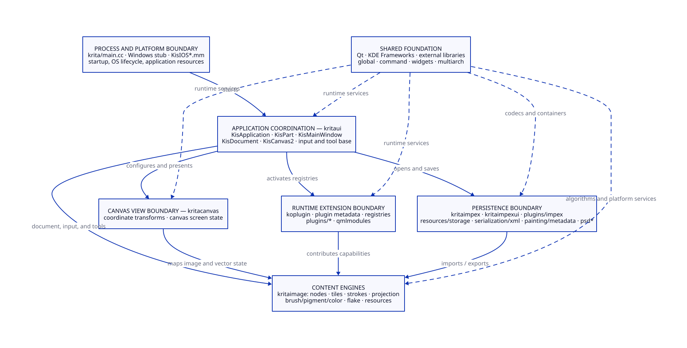
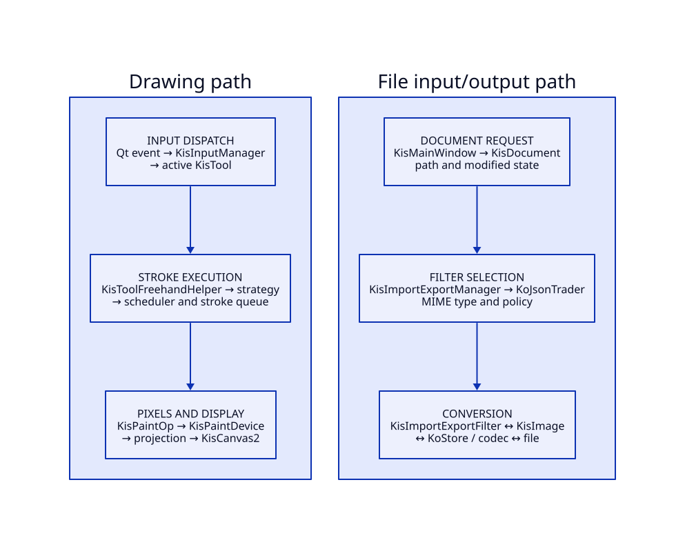
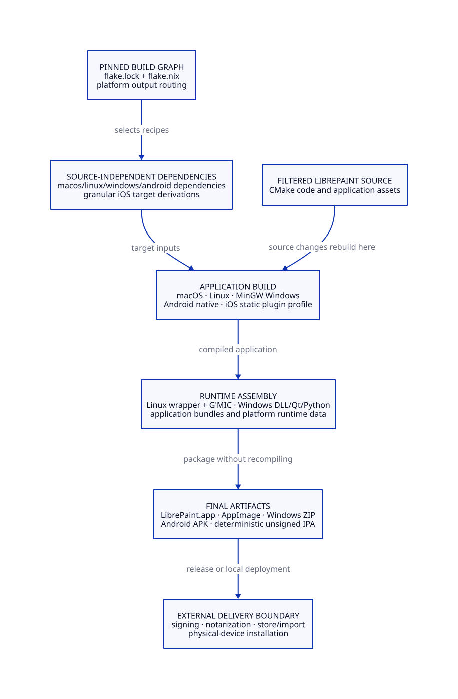

# LibrePaintアーキテクチャガイド

## 目的

この文書は、変更内容から調査対象を絞り、LibrePaintの主要な設計境界と実行経路を把握するための入口です。設計判断に使う責務、経路、識別子を中心にまとめています。

作業の目的、前提、完了条件と検証結果は[GitHub Issues](https://github.com/serika12345/librepaint/issues)、
着手順と進行状態は[GitHub Projects](https://github.com/users/serika12345/projects/2)で管理します。
開発・検証コマンドと作業管理の手順は[LibrePaint開発マニュアル](DEVELOPMENT.md)を参照します。

- 変更を共通コード、プラグイン、プラットフォーム統合、配布定義のどこへ置くか
- 起動、描画、ファイル入出力がどの境界を通るか
- CMakeターゲット、実行時プラグイン、Nix出力の違い
- 調査時に最初に読むファイルと、その次に追う識別子

図は責務と主要な実行経路を示します。実際のリンク境界は各ディレクトリーの
`CMakeLists.txt`を正本とします。

## 全体構造

図の編集元は[code-architecture.d2](code-architecture.d2)です。

### パッケージ境界

[パッケージ境界方針](package-boundaries.json)は、責務と中核所有ターゲット、
責務間で許可する直接リンク方向だけを保持する。所有ターゲットは一つの責務へ一意に属し、
許可方向は有向非巡回グラフを形成する。

| 責務ID | 中核所有ターゲット | 対象 |
| --- | --- | --- |
| `application-configuration` | `kritaapplication` | 設定値、スナップ方針、プラットフォームのファイル交換 |
| `application-orchestration` | `krita`、`kritaapplicationui` | 起動、OSライフサイクル、ウィンドウ、作業空間 |
| `canvas-presentation` | `kritabasicflakes`、`kritacanvas`、`kritaflake`、`kritaworkspacepresentation` | 座標変換、キャンバス、ベクター、作業空間表示 |
| `document-lifecycle` | `kritadocument`、`kritadocumentfiles`、`kritadocumentui` | 文書寿命、変更状態、保存、取り消し、文書表示 |
| `import-export` | `kritaimpex`、`kritaimpexui` | 形式選択、検証、文書入出力、結果通知 |
| `input-interpretation` | `kritainput`、`kritainputui` | ポインター、キーボード、タッチ、タブレット、ショートカット |
| `painting-rendering` | `kritacolor`、`kritaimage`、`kritalibbrush`、`kritapainting`、`kritapaintingmetadata`、`kritapaintingundo`、`kritapigment` | 色、ブラシ、画像、投影、ストローク、描画、メタデータ |
| `plugin-infrastructure` | `kritaplugin` | メタデータ探索、ファクトリーとサービス種別の登録 |
| `resource-management` | `kritaresources`、`kritaresourcestorage`、`kritaresourceui` | リソースの保存、検索、タグ、選択、表示 |
| `tool-invocation` | `kritatools`、`kritatoolsui` | ツール命令、描画設定表示、キャンバス状態への呼出し |

`scripts/architecture/check_package_boundaries.py`は、高速検査で方針の所有一意性、
参照整合性、許可方向の非循環性を検査する。各プラットフォームの
`build-incremental <platform> configure`はCMake File APIの問い合わせを構築木に作成し、
構成直後の応答から中核ターゲットの存在、実際の直接リンク方向、全製品ターゲットの循環を
検査する。実構成が正本であり、生成したターゲット台帳は保守しない。

### 公開ヘッダーとプラグイン登録

`scripts/architecture/check_public_contracts.py`は、製品ソースと登録JSONを直接調べる。
所有パッケージの外から利用されるヘッダーには、所有ターゲットの公開マクロまたは公開ヘッダー
構築契約が必要である。

製品プラグインは登録マクロと兄弟JSONを一対一で持ち、IDが一意で、既知のサービス種別を
一つ宣言する。登録マクロ、JSONの存在、IDとサービス種別の整合性を直接検査する。
ターゲットの所有とリンク方向はCMake構成に基づく依存検査が担当する。

`libs/global/KoID.h`は識別子と表示名の共有値契約を所有し、遅延翻訳の格納実装は
`libs/global/KoID.cpp`が所有する。`KLocalizedString`の生成や翻訳関数を使用する利用元は
`<klocalizedstring.h>`を直接取り込み、`KoID.h`はBoost optional、`KisLazyStorage`、翻訳実装を
利用元へ伝播させない。

### 責務別の所有先

各責務は、所有ディレクトリー、公開APIの名前空間、主CMakeターゲットを次のように
対応付ける。新しい公開APIは対応する責務名前空間を使用し、所有ターゲットの公開面へ登録する。

| 責務 | 所有ディレクトリー | 新しいAPIの名前空間 | 主ターゲット |
| --- | --- | --- | --- |
| プラグイン基盤 | `libs/koplugin` | `Krita::Plugin` | `kritaplugin` |
| リソース管理 | `libs/resources` | `Krita::Resources` | `kritaresources` |
| 描画 | `libs/painting` | `Krita::Painting` | `kritapainting` |
| 入出力 | `libs/impex` | `Krita::ImportExport` | `kritaimpex` |
| キャンバス表示 | `libs/canvas` | `Krita::Canvas` | `kritacanvas` |
| 文書寿命 | `libs/document` | `Krita::Document` | `kritadocument` |
| ツール呼出し | `libs/tools` | `Krita::Tools` | `kritatools` |
| 入力解釈 | `libs/input` | `Krita::Input` | `kritainput` |
| アプリケーション設定 | `libs/application` | `Krita::ApplicationConfiguration` | `kritaapplication` |
| アプリケーション調整 | `libs/application/ui` | `Krita::Application` | `kritaapplicationui` |

パッケージ境界方針、実CMakeグラフ、公開契約の直接検査が、現在の所有、依存方向、
有向非巡回性、公開ヘッダー境界を継続して確認する。

`libs/ui/tool`の公開ヘッダーは、画面表示、入力、ストローク作成、描画実行を接続する
`kritaapplicationui`所有の実装である。ツール命令と設定値は`libs/tools`、設定表示は
`libs/tools/ui`が所有する。既存の公開大域C++識別子は確立済みのAPI・ABI名を維持し、
新しいAPIは上表の責務名前空間を使用する。`kritaapplicationui`が生成する
`KRITAUI_EXPORT`と生成ヘッダーの`kritaui`基底名は、既存ABIの公開名を維持する。

### 保存領域と描画実行

`libs/resources/storage`の`kritaresourcestorage`はZIPとディレクトリーの保存を、
`libs/serialization/xml`の`kritaxmlserialization`はXML名前空間と逐次書出しを所有する。
保存側はQt Core、KConfig、QuaZip、XML側はQt Coreを利用し、上位の製品所有者から独立する。
`libs/resources/ui`は資源の選択・タグ表示を、`libs/tools/ui`は描画設定の表示を担当する。

`libs/painting/strokes`はストローク実行、`libs/painting/undo`は画像・キャンバス向けの
取り消し処理、`libs/painting/metadata`は画像メタデータを所有する。
画像層が利用する`kritapaintingundo`と`kritapaintingmetadata`を、画像層を利用する
`kritapainting`から分けることで、依存方向を一方向に保つ。
資源スナップショットは`libs/resources`の読出し接続面を保持する。

図形描画は`libs/painting/kis_figure_painting_stroke.{h,cpp}`が所有し、
`KisFigurePaintingStroke`の寿命がストロークの開始、ジョブ追加、終了、取消しをまとめる。
入力中に編集する図形は、同じストロークの一時領域から以前の図形を消して描き直し、
明示的な更新要求で画布へ表示する。直接描画のプリセットは画布の画素を共有するため、
この差し替えを行わずツール側の輪郭表示を使う。
描線・塗り値は`KisFigurePaintingOptions.h`が定義し、列挙値の順序とスクリプトの
スタイル名との対応を維持する。
色採取は`libs/painting/KisColorSamplerStroke.{h,cpp}`が実行し、採取ジョブの後に
完了ジョブとストローク終了を並べ、最後の採取色を一度だけ確定通知する。
UI側は対象画像、参照画像、キャンバス色資源、カーソルとプレビューを接続する。

### 入出力と文書寿命

`libs/impex`の`kritaimpex`は形式探索、MIME選択、結果分類、事前検査、変換フィルターを
所有する。`libs/impex/ui`は文書変換の調整、利用者通知、クリップボード、ダイアログと
画像読込補助を、`libs/impex/animation`は動画符号化の調整を所有する。
これらのUI接続は`kritaimpexui`が担当する。

[文書パッケージの責務境界](document-package-boundaries.md)に従い、文書状態は
`libs/document/session`の`kritadocument`が所有する。公開依存はQt Coreである。
`kritadocumentfiles`は文書ファイル、バックアップ、自動保存ファイル、回復ファイルを、
`kritadocumentui`はダイアログ、状態表示、文書情報編集、取り消し履歴の接続と表示を所有する。
形式処理と表示が共有する直列化対象の文書情報は`libs/impex/metadata`が所有する。
`KisDocument`は文書全体の寿命、タイマー、通知、画像、保存・回復の実行を調整する。

| 状態の所有者 | 維持する契約 |
| --- | --- |
| `Krita::Document::Identity` | 表示用パスと実ファイルパスを独立して保持する。同一パスの再設定では変更通知を要求せず、保存用スナップショットへ識別状態を複製する |
| `Krita::Document::ModificationState` | 同じ変更済み値の再設定でも保存中と自動保存後の変更を記録する。未変更への遷移で取り消し不能変更を消去し、保存用複製では進行中の保存と自動保存の経過を初期化する |
| `Krita::Document::AutoSaveState` | 自動保存の開始・終了と連続失敗を管理する。3回の連続失敗後は次の試行で複製経路を選び、通常間隔へ戻ると失敗履歴を消去する |
| `Krita::Document::RecoveryAutoSaveState` | 未処理の要求を一度だけ完了する。保存開始から戻る前の完了は開始結果が確定するまで延期し、既存の背景保存から得た保存先を回復要求へ引き継ぐ |
| `Krita::Document::RecoveryStatus` | 回復状態が変わる場合だけ通知を要求する。保存用スナップショットは通常文書状態から始まる |

文書UIは必要な下位所有者を直接利用する。履歴接続は非所有の借用寿命と同一スレッド上の
同期通知を維持する。回復候補は値として表示し、保存先検査、候補探索、使用可否判定、消去は
`libs/document/files`が担当する。

文書UIと入出力の共有ライブラリーは、責務別の内部オブジェクトを集約する。
契約試験は対象の内部実装を直接リンクし、画像を必要とする寸法・登録・書出し前分類だけが
画像実装を利用する。公開ヘッダー、保存領域ライター、エラー分類の検査は、それぞれの
利用側に必要な依存だけで構築する。構築対象と試験の対応は各所有先の`tests/CMakeLists.txt`を参照する。

### キャンバス表示

`libs/canvas`の`kritacanvas`は座標変換、画面状態、表示用画像片、投影更新情報、
投影取得接続面、拡大縮小済みフレームを所有する。座標変換器は構築時に取り込んだ
幾何情報を保持し、元画像の解放後も変換結果を利用できる。

呼出し側は更新片の寸法、画面プロファイル、変換方法、画素フィルターを渡す。
`libs/ui/canvas/kis_qpainter_projection_factory.*`がUI設定と画像投影実装を接続し、
`libs/ui/opengl/kis_opengl_update_info.*`はOpenGL固有の更新情報を扱う。
表示用投影は汚れ領域を通知し、空の更新では直前の有効フレームを保持する。

表示色の設定値、Qt画面色空間との変換値、画素・画像の色変換、表示フィルター接続面は
`libs/canvas/color`が所有する。`libs/ui/canvas/kis_display_color_converter.*`は
現在ノード、設定通知、前景色、画面パレットと変換本体を接続する。

`libs/canvas/animation`と`libs/canvas/tiles`はフレーム範囲、差分保存、ディスク直列化、
タイル転送バッファーを所有する。`libs/ui/animation`は現在画像と再生状態、生成時機、
設定変更を調整し、`libs/ui/animation/cache`はOpenGL更新情報と保存値を変換する。
タイル転送領域は`kis_tile_data_pool.{h,cpp}`が確保・返却し、
`kis_tile_data_buffer.h`が領域、画素寸法、共有プールを一組として管理する。

### ツール操作と入力解釈

`libs/tools`の`kritatools`はツール命令、操作状態、描画入力値を所有する。
キャンバスの借用契約は`libs/canvas/KisToolCanvas.h`が定義し、依存はツールから
キャンバスへ向かう。`libs/ui/tool`は座標変換、編集可否の通知、輪郭表示、設定部品と
画像・キャンバスの具体的な接続を担当する。

| 所有先 | 操作と責務 |
| --- | --- |
| `libs/tools/kis_tool_paint_interaction.{h,cpp}` | ポインター追跡、ブラシ寸法・回転操作、輪郭状態と生成 |
| `libs/tools/kis_rectangle_interaction.{h,cpp}` | 矩形制約、修飾キー、ドラッグ座標、回転、正方形化、移動、中央拡張 |
| `libs/tools/kis_outline_interaction.{h,cpp}` | 自由形状の点列、継続入力、点の取り消し、完了・取消し |
| `libs/tools/kis_polyline_interaction.{h,cpp}` | 多角線の点列、ドラッグ区間、閉路状態、点の取り消し、完了・取消し |
| `libs/tools/kis_quick_shape.{h,cpp}` | 保持した自由描画の点列、静止判定、直線・回転楕円の当てはめ、円への切替え、直線の終点追従と楕円の拡大縮小・回転 |
| `libs/ui/tool/KisQuickShapePreview.{h,cpp}` | 図形編集のパスとブラシ見本の保持、輪郭に沿った表示、変更前後を含む再描画範囲 |
| `libs/tools/kis_painting_information_builder.{h,cpp}` | 圧力曲線、速度、傾き、時刻、キャンバス状態から描画入力値を組み立てる |
| `libs/tools/kis_speed_smoother.{h,cpp}` | 速度の平滑化 |
| `libs/tools/kis_stabilized_events_sampler.{h,cpp}`、`KisStabilizerDelayedPaintHelper.{h,cpp}` | 入力の実時間標本化と遅延描画キュー |
| `libs/tools/ui` | 選択設定、ツール設定ポップアップ、矩形制約の表示と設定通知 |
| `libs/flake/KoBasicShapeFactory.{h,cpp}` | 登録済み図形ファクトリーを優先し、未登録時は同じ境界矩形のパス図形を生成する |

UI設定は`libs/ui/tool/kis_painting_information_builder_config_p.h`から値として渡し、
座標変換と自由描画への接続は`kis_painting_information_builder_adapters.{h,cpp}`が担当する。
`TestToolCoreContract`と`TestToolSettingsUiContract`は操作結果と設定の保存・再読込を検査する。

自由描画を500ms保持すると、`KisToolFreehand`が元のストロークを取り消して図形編集へ移る。
直線は始点を固定し、ホールド中と解放時のペン位置を終点にする。
楕円は中心を固定し、ホールド開始位置からの距離比で拡大縮小し、中心まわりの角度差で回転する。
円への切替え中も楕円の縦横比と編集した角度を保持し、楕円へ戻すと復元する。
ホールド中の終点移動、楕円の拡大縮小・回転、円への切替えは、GUIスレッドでパスを更新する。
元の描画を一度取り消し、ストローク開始時の設定とホールド直前の平滑化済み入力を保持する。
`libs/painting/kis_figure_painting_stroke.{h,cpp}`の`createPreviewSample`は、一時描画デバイス上で
小さなブラシ見本を一度生成する。見本の描画範囲は256×256、ブラシ寸法は64画素以内へ
縮尺を合わせ、返す素材は幅256画素・高さ128画素以内に収める。
ブラシ本体、マスク、筆圧、不透明度、前景色、背景色、質感と乱数を見本へ反映し、
作業スレッドで表示色へ変換する。文書の画素とUndo履歴は準備と変形中に保持する。
`libs/ui/tool/KisQuickShapePreview.{h,cpp}`は、見本と形状をQt GUIの値として保持する。
変形中は見本を輪郭に沿う帯へ写し、端点の見本も表示する。帯の幅は一定で、楕円の
拡大縮小と回転も色・透明感・太さを保持する。帯の継ぎ目は画素を置き換えて不透明度の
重複を防ぎ、画素補間で輪郭を滑らかにする。表示画像は可視範囲と画面解像度に合わせ、
形状と表示変換が同じ間は再利用する。変更前後の占有範囲を再描画する。
変形中の表示は保持したブラシ見本による近似とする。文書のレイヤー合成、選択範囲、
ミラー描画、消しゴム、ブラシの位置依存の効果は確定時の描画経路が適用する。
これにより表示更新を文書の描画キュー、レイヤー再合成とUndo生成から独立させる。
ツール切替えや新しいストロークの開始後に届いた見本は、操作世代で判定する。
ポインターの解放時に確定パスを`KisFigurePaintingStroke`へ一度渡し、元のストロークの設定一式を
独立したコピーとして引き継ぐ。ホールド直前の入力で元の解像度へ描き、Undo一回分にまとめる。
文書への描画が完了するまでプレビューを保持する。
`KisQuickShapePreviewContractTest`は即時の形状追従、幅・色・透明感の維持、継ぎ目の不透明度、
取消し、画素補間と大きな図形の表示時間を検査する。`FreehandStrokeContractTest`は、
見本の寸法と文書状態の維持、解放時の描画結果、保持した筆圧と設定、Undo／Redoを検査する。

画像グラフの変更は`libs/image/commands`が所有する。
`kis_node_commands_adapter.*`は操作対象画像を弱参照し、ノード追加、移動、削除、属性変更の
取り消し可能な命令を作る。`kis_node_operation_batch.*`は連続操作を一つの履歴項目へまとめ、
選択復元に必要なアクティブノードを呼出し側から値として受け取る。
`kis_node_group_operations.*`はグループ化と解除を担当する。
`KisNodeManager`は画像を画面切替時に結び直し、編集可否、選択、互換性エラーと画面更新を接続する。
ミラー処理の範囲、フレーム、並行ジョブ、履歴登録は`KisMirrorProcessingVisitor::applyToNodes()`が構成する。

`libs/input`の`kritainput`はショートカット照合、単発・ストローク入力、タッチと
ネイティブジェスチャー判定を所有する。正規化済みの入力値から`KisInputAction`へ命令を通知し、
入力管理器が所有する内部委譲オブジェクトがUIアクションへ接続する。
プロファイルの永続値は`kis_input_profile.*`と`kis_shortcut_configuration.*`が保持し、
UIが安定したアクション識別子を具体的なアクションへ解決する。
`KisInputEventSuppressor`は事象種別、ボタン種別、合成元から抑止理由を決定する。

`libs/input/ui`の`kritainputui`はQt事象接続、設定表示、診断、プラットフォーム統合を所有する。
macOS、Linux、Android、Windowsでは共有ライブラリー、iOSでは静的ライブラリーとして構築する。
利用元は`input/ui/...`の公開ヘッダーと`kritainputui`への直接リンクを使う。
入力管理器は、入力操作の実行中に追加のタッチ点が届いたとき、その位置を活動中のツールへ通知する。
スタイラス描画中の指の接触のように描画へ抑止される事象も通知対象に含め、解釈は活動中のツールへ委ねる。
入力装置の識別値とQt分類変換は`libs/flake/KoInputDevice.{h,cpp}`が所有する。

### アプリケーションと画面の接続

`libs/application`の`kritaapplication`は設定値、スナップ方針、プラットフォームの
ファイル交換を所有する。`libs/application/ui`の`kritaapplicationui`はプロセス調整と
作業空間を所有し、`kritaapplication`を直接利用する。
`libs/ui/CMakeLists.txt`は画面側のソース、生成UI、プラットフォーム実装を
`kritaapplicationui`へ集約し、`kritaui_export_instance.h`はテンプレートの公開記号設定を所有する。

アプリケーション調整は各画面・文書の具体的な所有者を呼び出す。

| 接続先 | 責務 |
| --- | --- |
| `libs/ui/dialogs/KisDlgPreferencesNotifications.cpp` | 設定確定通知 |
| `libs/ui/nodes/KisNodeManagerImageState.cpp` | ノード表示、選択操作、活動ノードとマスクの状態 |
| `libs/ui/document/KisDocumentImageState.cpp` | 画像名、動画範囲・フレーム率、投影待機、メモリー統計 |
| `libs/impex/animation/KisAnimationRenderingOptions.cpp` | 動画書出し設定 |
| `libs/ui/canvas/KisCanvasImageState.cpp` | キャンバスの画像信号接続と表示準備 |
| `libs/ui/canvas/KisCanvasColorDrop.cpp` | 色ドロップによる塗りつぶしストローク |
| `libs/ui/document/KisImageManagerDrop.cpp` | 画像・URL・参照画像の取込み |
| `libs/ui/canvas/kis_canvas_resource_provider.{h,cpp}` | キャンバス資源の初期化と組込み描画資源登録 |
| `libs/ui/canvas/KisDisplayConfig.{h,cpp}` | 表示色管理の初期化 |
| `libs/ui/animation/kis_animation_cache_populator.{h,cpp}` | 文書画像追跡とキャッシュ生成通知 |

状態接続の変更では、画像・ノードの共有寿命、進捗表示の借用寿命、画像信号と資源依存の
登録順、ノード通知の直接接続、複製前の操作完了待機と読取障壁ロックを維持する。
起動時は資源種別・MIME型・優先度に従って登録し、色管理と共有監視の生成・破棄を
アプリケーションの寿命に合わせる。

主要ディレクトリーの役割は次のとおりです。

- `krita/`はプロセスの入口、アプリケーション資産、OSライフサイクルとの接続を持ちます。主要機能は`libs/`と`plugins/`が所有します。
- `libs/input`の`kritainput`と`kritainputui`は入力列の解釈、Qt接続、設定表示、プラットフォーム統合をまとめます。
- `libs/application/ui`の`kritaapplicationui`はアプリケーション、ウィンドウ、文書、キャンバス、ツール共通部をまとめます。
- `libs/impex`の`kritaimpex`と`kritaimpexui`は形式契約、文書入出力、利用者通知をまとめます。
- `libs/image`の`kritaimage`はレイヤーツリー、ペイントデバイス、タイル、ストロークキュー、投影更新を扱います。
- `plugins/`はツール、ブラシエンジン、フィルター、ドッカー、ファイル形式などの機能をレジストリーへ登録します。

`libs/ui`は画面機能と、`KisDocument`、ツール共通処理などのアプリケーション調整を
扱います。入出力管理は`libs/impex`に置き、`KisImage`は画像内容と非同期処理を中心に扱い、
ウィンドウとファイル名は`libs/ui`側が所有します。

## 主要な設計境界

### プロセス入口とアプリケーション初期化

通常のOSでは[krita/main.cc](../../krita/main.cc)の`main`が入口です。Windowsでは[krita/windows_stub_main.cpp](../../krita/windows_stub_main.cpp)の小さな実行形式が、共有ライブラリー側の`krita_main`を呼びます。`krita_main`の実装本体はどちらも`main.cc`です。

MSVC構築では[winquirks/unistd.h](../../winquirks/unistd.h)がPOSIX形式のプロセス・利用者・
標準ストリーム識別子、`readlink()`、`sleep()`をWindows CRTとWin32 APIへ接続する。
[winquirks/tests](../../winquirks/tests)はこの互換境界を実際のMSVC実行形式で検査する。

Androidでは[libs/global/KisAndroidCrashHandler.cpp](../../libs/global/KisAndroidCrashHandler.cpp)の
`handler_init()`が致命的シグナル用の代替スタックとコールバックを登録する。コールバックは
unwindstackで現在プロセスのフレームを取得し、アプリケーションデータ領域の
`kritacrashlog.txt`へ記録してから以前のシグナル動作を再実行する。
[KisAndroidCrashHandlerContractTest.cpp](../../libs/global/tests/KisAndroidCrashHandlerContractTest.cpp)は
ARM64実機の子プロセスでこの経路を実行し、バックトレースと終了シグナルを検査する。

`KisApplication::start()`は、おおむね次の順で初期化します。

1. グローバルなファクトリーと設定
2. リソース型
3. プラグインが登録する各レジストリー
4. リソースデータベースと同梱リソース
5. `KisPart`、セッション、`KisMainWindow`
6. 自動保存の復旧と起動引数の文書

iOSのライフサイクル、メモリー警告、Pencilダブルタップは`KisIOS*.mm`から`main.cc`へ通知されます。Pencilの対話オブジェクトはQtのメインビューが所有するUIKitウィンドウへ登録し、その所有先を維持します。ウィンドウの可視化、キー化、前景復帰は同じ登録先への再試行を起動します。タッチ向け画面は[plugins/extensions/iostouchui](../../plugins/extensions/iostouchui)にあり、OS通知の橋渡しと画面機能を分離しています。キャンバスのみ表示のブラシ一覧は名前付きの縦一覧として右側に表示し、色選択は同じ画面の子パネルとして安全領域内の上部バー直下へ右寄せします。ブラシ、レイヤー、色の各パネルは一つずつ表示し、画面回転とキャンバス寸法変更で再配置します。

### 文書と画像モデル

`KisDocument`は文書識別と変更状態の公開API、通知、自動保存、読み込み・保存、
`KisImage`の差し替えを調整します。識別値は`Krita::Document::Identity`、変更状態は
`Krita::Document::ModificationState`が所有します。`KisImage`は次を所有します。

- `KisNode`を基底とするレイヤー・マスクのツリー
- `KisPaintDevice`と`tiles3/`の画素タイル
- 合成結果である投影
- `KisUpdateScheduler`、`KisStrokesQueue`、更新キュー
- アンドゥ可能なストロークと画像変更通知

レベル補正の数値状態と転送表は`libs/image/KisLevelsCurve.{h,cpp}`が所有する。実装は
`kritaimagelevelscurveobjects`として限定構築でき、`kritaimage`が同じ生成物を製品へ集約する。
`KisLevelsCurveContractTest`は恒等写像、入出力点とガンマ、値意味論、転送表、文字列表現を
製品共有ライブラリーへ接続せずに検査する。

画像状態だけで完結する処理は`libs/image`側、ファイル名やダイアログ、
ウィンドウと連携する処理は`libs/ui`側から検討します。

### 色チャンネル記述

画素内チャンネルの名前、格納位置、表示順、数値型、格納寸法、表示範囲、表示色は
`libs/pigment/KoChannelInfo.h`が値として保持する。`KoChannelInfoContractTest`は数値型からの
寸法・範囲導出、画素順と表示順の対応、バイト位置比較をQtだけの限定対象で検査する。

### プラグインとレジストリー

プラグインはJSONメタデータのサービス種別、ID、対応MIME型などで発見され、コンストラクターからレジストリーへファクトリーを登録します。[KoJsonTrader.cpp](../../libs/koplugin/KoJsonTrader.cpp)が候補を列挙し、[KoPluginLoader.cpp](../../libs/koplugin/KoPluginLoader.cpp)が重複版と無効化設定を処理します。

デスクトップでは`lib/kritaplugins`などから動的に読み込みます。iOSでは
`kis_add_library`が`MODULE`を静的ライブラリーへ変換し、
`krita_ios_target_static_plugins`が実行形式へ登録・リンクします。組み込む対象の
正本は[initial-plugin-profile.json](../../packaging/ios/manifests/initial-plugin-profile.json)です。
CMakeはファクトリー名をターゲットごとに一意化し、実行形式へ直接リンクする生成コードから
ファクトリーとQt資源の初期化関数を参照します。これにより不要コード除去後も登録とJSONを保持します。
`audit-static-dependency-resources.py`は最終実行形式の資源初期化・解放関数の集合と一意性を、
静的資源マニフェストの`final_binary`に照合します。除外実装のシンボルも確認します。

機能を追加するときは、C++クラスと次の識別子を一組として確認します。

- 近傍の`CMakeLists.txt`にあるターゲット名
- `K_PLUGIN_FACTORY_WITH_JSON`などが参照するJSON
- `Id`、`X-KDE-ServiceTypes`、MIME型
- アクションIDと`*.action`／XMLGUI定義
- iOSへ含める場合は静的プラグインプロファイル

### Qtリソースとインストール資産

[krita/krita.qrc](../../krita/krita.qrc)は、`kritarc`と`krita5.xmlgui`をQtリソースへ割り当てる小さな目録です。アプリ全体のQtリソース一覧は[krita/CMakeLists.txt](../../krita/CMakeLists.txt)の`krita_QRCS`にあります。アイコン、シェーダー、カーソル、スプラッシュ、既定プリセットなどはそこから実行形式へ組み込まれます。

`install(FILES|DIRECTORY ...)`で配置する資産はQtリソースとは別です。特に`krita/data`、`pics`、`po`、プラグインJSON、バンドル資産を変更するときは、実行時参照方法がリソースURLかインストール先パスかを先に確認します。

iOSのインストール資産と静的依存資源は[資産の採用・帰属資料](../ios/non-code-assets.md)に従います。
製品とQt／KFのライセンス目録は`packaging/ios/manifests/`、同梱する帰属は
`packaging/ios/notices/`が所有します。

### モバイルの共通処理とOS境界

描画、文書、形式変換、ブラシ、ツール、ドッカーの処理は共通の所有者に置きます。
AndroidのActivity／JNIとiOSのUIKit通知は、各OSから既存のアプリケーション操作へ接続します。
ファイル選択はAndroidの内容URI、iOSのsecurity-scoped URLの寿命と権限をそれぞれ扱います。
Pencil／S Penの補助操作も各OSで受け、共通のアクションを実行します。
共通化は現在の利用側と必要な依存方向に従い、具体的な所有者へ責務をまとめます。

iOSのFiles保存は、アプリの一時領域で書出しを完成させ、選択されたファイル自身のハンドルを通じて
転送します。これにより、提供元が親ディレクトリーへの書込みを許可しない場合も選択先への権限を使えます。
バックアップと自動保存はアプリの回復領域へ置き、転送失敗時は完成済み一時ファイルと診断パスを保持します。

iOSのメモリー予算は、既定を物理RAMの25%かつ最大1 GiB、手動設定上限を37.5%かつ最大1.5 GiBとします。
UIKitの警告時にタイルとピックスマップのキャッシュを解放します。
入力配送中のノード／UI変更はキュー接続で配送完了後へ送ります。
塗りつぶしレイヤーの非同期ダイアログは、入れ子のイベントループによる再入を避ける別の境界です。

キャンバスのみ表示はタブなし・枠なしの最大化表示を使い、終了時に元のウィンドウ属性とタブ表示を復元します。
短い内向きピンチは最も近い90度単位の向きへ合わせ、描画ツールバー下の表示領域へ回転・拡大率・中心を
補間します。通常のピンチ・回転は連続操作を維持し、新しいタッチは補間を中断します。
画面の再設計は[Issue #64](https://github.com/serika12345/librepaint/issues/64)、
機能の採用と実機受入れは[Issue #67](https://github.com/serika12345/librepaint/issues/67)が所有します。

## 実行時の主要経路

図の編集元は[runtime-paths.d2](runtime-paths.d2)です。

### 描画

自由描画を追う場合の基準経路は次のとおりです。

1. Qtのポインター／タブレット／タッチイベントを`KisInputManager`がショートカットと入力アクションへ振り分けます。
2. `KisToolInvocationAction`と`KoToolManager`が現在のツールへイベントを渡します。
3. `KisToolFreehand`と`KisToolFreehandHelper`が入力点、筆圧、傾き、プリセットの状態を`FreehandStrokeStrategy`のジョブへ変換します。
4. `KisImage::startStroke/addJob/endStroke`が`KisUpdateScheduler`と`KisStrokesQueue`へ処理を渡します。
5. 選択中の`KisPaintOp`が`KisPaintDevice`のタイルを更新します。
6. dirty領域から投影更新が計画され、`KisCanvas2`へ更新通知が戻ります。

入力の不具合はイベント受信から、ブラシ結果の不具合は`KisPaintOp`から、並列実行・アンドゥ・再描画の不具合はストローク戦略とスケジューラーから調べます。

この経路は次の観測可能な契約で検査します。

| 段階 | 所有者と主要分岐 | 観測する状態と不変条件 | 現在の契約検査 |
| --- | --- | --- | --- |
| 入力受信と照合 | `libs/input`、`libs/input/ui`。マウス、タブレット、タッチ、ネイティブジェスチャー、合成マウス事象の抑止へ分岐する。 | 入力列、選択したアクション、開始・継続・終了・取消し、フォーカス喪失後の状態、アクション群マスクを観測する。一つの物理入力列から有効な命令列を一つ生成し、終了後に照合状態を残さない。 | `TestInputShortcutMatcher`、`TestInputEventSuppressor` |
| ツール呼出しと描画入力値 | `libs/tools`、`libs/ui/tool`。平滑化なし、基本平滑化、加重平滑化、安定化、遅延描画、保持した形状の当てはめへ分岐する。 | 座標、筆圧、傾き、回転、速度、時刻、入力順、完了と取消しを観測する。正規化済み入力値と順序をストローク生成まで保持する。 | `TestToolCoreContract`、`KisStabilizedEventsSamplerTest`、`KisQuickShapeContractTest` |
| ストローク実行 | `libs/painting/strokes`と`libs/image`のストロークキュー。開始、ジョブ追加、終了、取消し、アンドゥ、リドゥ、非同期更新へ分岐する。 | ジョブ順、アンドゥ命令、キュー完了、`KisImage::isIdle()`と`hasUpdatesRunning()`を観測する。終了後は全ジョブが完了し、取消しとアンドゥは開始前の状態を復元する。 | `FreehandStrokeContractTest`、`kis_strokes_queue_test` |
| ブラシ画素生成 | `plugins/paintops`、`libs/brush`、`libs/painting`。プリセット、PaintOp、合成方法、間隔、筆圧・速度・乱数センサーへ分岐する。 | 対象ペイントデバイスの画素、変更範囲、乱数源を観測する。同じ固定入力と描画設定は定義した比較規則内で同じ画素結果を生成する。 | `FreehandStrokeContractTest`、PaintOp別試験 |
| タイル更新と投影 | `libs/image`。dirty領域、更新スケジューラー、レイヤー合成、投影更新へ分岐する。 | レイヤー画素、投影画素、画像更新通知、更新キュー完了を観測する。待機完了後の投影は確定したレイヤー状態と一致する。 | `FreehandStrokeContractTest`、`kis_update_scheduler_test`、`kis_projection_test` |
| キャンバス転送と表示 | `libs/canvas`、`libs/ui/canvas`。拡大率、回転、鏡像、色変換、CPU・OpenGL表示へ分岐する。 | 投影キャッシュ、更新矩形、座標変換、表示色、最後の有効フレームを観測する。変更領域を表示座標へ変換し、無効な更新では直前の有効フレームを保持する。 | `kis_prescaled_projection_contract_test`、`kis_coordinates_converter_test`、`kis_display_color_transform_test` |

PaintOpの実行処理は`plugins/paintops/libpaintop`の`kritapaintopruntime`、既定画素ブラシの実行処理は
`plugins/paintops/defaultpaintops`の`kritapixelbrush`として、設定画面から独立して構築できます。
製品の`kritalibpaintop`共有ライブラリーと`kritadefaultpaintops`モジュールはこれらを集約するため、
既存の公開面とプラグイン登録は同じ製品経路を使います。PaintOp設定値の読書きを担い画面を所有しない
`KisPaintopPropertiesBase`は`libs/image/brushengine`が所有します。

ブラシ設定値の保存、復元、型変換、既定値処理は`libs/image/kis_properties_configuration.cc`が担い、
`kritaimagepropertiesconfigurationobjects`がこの実装と直列化・曲線値の依存を所有します。
`kritaimage`は同じオブジェクトを製品へ集約し、`plugins/paintops/libpaintop`の設定値契約試験は
この所有対象を直接使います。設定値契約は製品と同じ保存結果を観測しながら、画像処理全体を
試験対象へ含めない構築範囲を維持します。

自由描画の基準契約は[FreehandStrokeContractTest.cpp](../../libs/ui/tests/FreehandStrokeContractTest.cpp)です。
sRGB 8ビットの500×500画素画像、単一ペイントレイヤー、`autobrush_300px.kpp`、
`(200, 200)`から`(300, 300)`までの2入力点、筆圧1、傾き・回転・接線方向筆圧・時刻・速度0、
遠近1、非ミラー、無選択、不透明度1、作業スレッド1本を固定します。プリセットは直径300、比率1、
間隔0.1の円形自動ブラシで、筆圧による不透明度と寸法だけが有効です。散布、テクスチャ、Fuzzy
センサーを使わないため、この契約の画素結果はストローク乱数源を消費しません。終了結果は
[autobrush-finished-projection.png](../../libs/ui/tests/data/freehand-contract/autobrush-finished-projection.png)を
維持する契約として比較し、RGBは完全一致、アルファ値は8ビット値で±3以内とします。
レイヤーと投影の正確な描画領域は`QRect(50, 50, 385, 385)`です。
取消しとアンドゥは開始前のレイヤーおよび投影への完全一致、リドゥは同一実行内の終了結果への
完全一致を要求し、各操作後に画像更新が停止して待機状態へ戻ることを確認します。

同じ描画条件で両端の筆圧だけを0.5へ変えた契約は、レイヤーと投影の完全一致、正確な描画領域
`QRect(126, 126, 234, 234)`、RGBA8888へ正規化した全画素のSHA-256
`ffdae59742d86fcfcc3764eeb7d2e82c126cd9cb08fb7c7c97a94e8b46cd5bb9`を維持します。
ハッシュが異なる場合は実画像を試験出力ディレクトリーへ保存し、画素差の調査入口とします。
開始筆圧0.25から終了筆圧1.0へ変化する契約は、同じ正規化と診断方法で描画領域
`QRect(154, 154, 229, 229)`、SHA-256
`e9740f2b00ef8670a37aade2c4f96cec8197dfc96eb3e18adcc20f938b5f87c0`を維持し、
筆圧の補間を含む画素応答を固定します。

乱数経路の契約は寸法センサーをFuzzy Dabへ切り替え、`FreehandStrokeStrategy`から
`KisStrokeRandomSource`が所有する描点単位の乱数源へ明示した種を渡します。通常の種無指定経路と
ストローク単位の乱数源は従来の初期化を維持します。種17は同じ入力を繰り返したときに
`QRect(142, 142, 271, 271)`と、RGBA8888へ正規化した全画素のSHA-256
`34a090d8b904e9950f2bf7868b2c7b1f78c2d5bb3ddb8a531a90f203721c21d3`へ完全一致します。
種18は異なる画素結果を生成し、設定が実際に乱数経路を消費することを検査します。

ブラシ間隔の契約は同じ固定入力で自動ブラシの間隔だけを0.1から0.25へ変更します。
レイヤーと投影の正確な描画領域は`QRect(50, 50, 353, 353)`、RGBA8888へ正規化した
全画素のSHA-256は
`8bdf0e95ea7526b6289bf2393397c7bb005b69da6866891c2cb12bf991d7f210`です。既定間隔0.1の
385×385画素領域より小さい結果を維持し、間隔設定から自由描画補間の描点配置までを検査します。

速度応答の契約は寸法センサーをSpeedへ切り替え、2入力点の速度を0.5へ固定します。
レイヤーと投影の正確な描画領域は`QRect(125, 125, 235, 235)`、RGBA8888へ正規化した
全画素のSHA-256は
`3c7c2e19b4b91a27b8d1ddb1068db753012e01f98244eb9e6f688026db4f551a`です。速度0の既存入力と
同じプリセットを使い、`KisPaintInformation`の速度値から寸法センサーの画素応答までを検査します。

矩形選択の契約は自由描画の基準契約と同じ条件へ画像座標`QRect(225, 225, 100, 100)`の選択だけを
追加します。レイヤーと投影の正確な描画領域は選択範囲と一致し、RGBA8888へ正規化した全画素の
SHA-256は`4f5b7f971268c853d893a2c6c25d805cb354eef8c1d6c26fffeaac5dafa4d219`です。
選択外の全画素は描画前の状態との完全一致を要求します。契約対象は画素ブラシとPaintOp実行処理の
オブジェクトを直接利用し、製品の`kritapixelbrush`は同じ画素ブラシ実装を集約します。

### 公開APIの振る舞い契約

テストは、利用者から観測できる戻り値、状態変化、通知、副作用、失敗条件、状態遷移と
ドメイン上の不変条件を守ります。リファクタリングの前には対象の呼び出し側と既存試験を確認し、
必要な保証を観測する試験を実行します。試験コードとCMake定義が検証内容と実行方法の正本です。

互換性検査は、明示したソース互換性・バイナリー互換性などの要件と適用範囲を根拠に維持します。
型や宣言形状、内部構造の検査は、公開契約としての意味を確認して整理します。
重要な状態を観測するgetterや、利用側に必要な通知順序・所有期間も振る舞い契約の対象です。

各試験は、失敗時に利用者から見て何が壊れるかを説明できることを保守基準とします。
必要な意味論の検証が不足している場合は公開操作と結果による試験を追加し、
実装詳細だけの固定は削除します。実装を模写する試験やAPIごとの対応表は、
実装変更を不必要に制約するため作成しません。

入力事象と画素生成は独立した契約で検査します。
[KisToolProxyContractTest.cpp](../../libs/input/ui/tests/KisToolProxyContractTest.cpp)は、マウス、
タブレット、単点タッチの開始・継続・終了、文書座標、筆圧、傾き、回転、時刻と入力種別を検査します。
マウスの既定値は筆圧1、傾き・回転0です。開始をツールが受理しない場合は未受理結果を返します。
入力の照合と合成マウス事象の抑止は`TestInputShortcutMatcher`、`TestInputEventSuppressor`、
入力管理器の試験が所有します。単一試験入口は指定試験と宣言済み依存だけを構築し、
自由描画契約は具体的な画素ブラシを試験処理内で登録します。

### 投影更新と表示画素の比較規則

[KisCanvasUpdatesCompressorContractTest.cpp](../../libs/ui/tests/KisCanvasUpdatesCompressorContractTest.cpp)は、
空の更新領域の除外、保留列が空から非空になるときの起動要求、投入順の排出を検査します。
新しい包含領域は、同じ詳細度の圧縮可能な旧更新だけを除去して列の末尾へ入ります。
部分重複、異なる詳細度、一括更新マーカーは維持します。

[kis_prescaled_projection_contract_test.cpp](../../libs/canvas/tests/kis_prescaled_projection_contract_test.cpp)は
画像座標から表示用投影への拡大と更新領域を所有し、
[KisQPainterCanvasDrawImageContractTest.cpp](../../libs/ui/tests/KisQPainterCanvasDrawImageContractTest.cpp)は
表示用投影からウィジェットへの転送を検査します。製品と試験は同じ
[kis_qpainter_canvas_draw_image.h](../../libs/ui/canvas/kis_qpainter_canvas_draw_image.h)を使います。

| 固定条件 | 比較規則と分類 |
| --- | --- |
| 8×8、恒等変換、更新矩形 `(2, 3, 3, 2)` | 矩形内の対応画素は完全一致し、矩形外は元の背景色を維持する |
| 8×8、1:1の水平鏡像・90度回転 | 不透明度は完全一致。位置を符号化した赤・緑は各1、青は2以内の差とする。一画素内側の採取を既知不具合として許容し、理想値への完全一致も受け入れる |
| 16×16の描画先、中央8×8の不透明領域、17.3度回転 | 投影21×21、変換済み包含矩形11×11、非透明画素領域10×10の包含関係を検査する |
| 同じ17.3度回転の境界 | 透明168〜184、半透明20〜36、不透明48〜64画素。半透明アルファ最小値1〜32、最大値160〜254とする |
| 同じ17.3度回転の不透明内部 | 色から復元した元画像位置と逆変換位置のx・y誤差は各0.05以下、青成分誤差は1.1以下とする |

水平鏡像と直交回転の既知不具合の上限を、任意角回転やGPU描画へ流用することは、
補間と描画装置が異なるため適切ではありません。Qtや描画装置の更新で比較値が安定しない場合は、
固定入力で差を採取し、幾何・包含関係と画素比較を分けて維持契約、既知不具合、未確定事項へ分類します。
基準の変更は対応Issueに根拠を記録し、対象試験の20回反復と隣接契約で確認します。
描画の最適化は[Issue #62](https://github.com/serika12345/librepaint/issues/62)、
追加の観測契約は[Issue #61](https://github.com/serika12345/librepaint/issues/61)が所有します。

### ファイル入出力

`KisDocument`は`libs/impex/ui`の`KisImportExportManager`へ処理を委譲します。
`libs/impex`の`KisImportExportFilterRegistry`が`Krita/FileFilter`プラグインをMIME型で選び、
管理クラスが`KisImportExportFilter::convert()`を呼びます。

- KRAやORAのようなコンテナー形式では`libs/resources/storage`の`KoStore`がZIP／ディレクトリー抽象化を提供します。
- XML名前空間と逐次書出しは`libs/serialization/xml`が提供します。
- 画像形式固有の符号化、設定画面、依存ライブラリー接続は`plugins/impex/<format>/`に置きます。
- 形式探索、結果分類、事前検査は`libs/impex`、非同期エクスポート、警告、原子的保存の調整は`libs/impex/ui`にあります。
- iOS／Androidの文書選択や内容URIの差は、Qtのファイル機構とプラットフォーム条件を通して共通の`KisDocument`経路へ合流します。

`KisImportExportFilter`の公開クラスとABIは`kritaimpex`が所有する。内部実装は、
`KisImportExportFilter.cpp`の状態と固定タグ、`KisImportExportFilterProgress.cpp`の進捗、
`KisImportExportFilterConfiguration.cpp`と`KisImportExportFilterSavedConfiguration.cpp`の設定、
`KisImportExportFilterCapabilities.cpp`と`KisImportExportFilterColorModels.cpp`の書き出し能力、
`KisImportExportFilterVerification.cpp`と`KisImportExportFilterZipVerification.cpp`の保存結果検証へ
分かれる。各実装は個別のCMakeオブジェクト対象として構築でき、共有ライブラリーが同じ公開クラスへ
集約する。

読込み中の利用者確認は`KisImportUserFeedbackInterface.cpp`と
`KisSynchronousImportUserFeedback.cpp`を一つの`kritaimpexuserfeedbackobjects`として所有する。
この対象はQt Widgetsだけに依存し、バッチ状態、質問コールバック、親表示部品の寿命を扱う。
`kritaimpexui`はそのオブジェクトを集約し、文書入出力の調整処理から同じ公開接続面を利用する。

アニメーション出力設定の公開クラスとABIは`kritaimpexui`が所有する。初期値、
出力モード、パス解決は`KisAnimationRenderingOptions.cpp`、画像設定との保存・復元は
`KisAnimationRenderingOptionsPersistence.cpp`が実装する。両実装は個別のCMakeオブジェクト対象として
構築でき、`kritaimpexui`が同じ公開クラスへ集約する。

遠隔ファイル取得は`KisRemoteFileFetcher.cpp`を`kritaimpexremotefilefetcherobjects`で個別構築する。
この対象はQt Network、Qt Widgets、翻訳、共通メッセージ表示に依存し、データURLを含む
遠隔URLの応答と出力装置への書込みを所有する。`kritaimpexui`はそのオブジェクトを集約する。

## 変更内容から見る場所

| 変更内容 | 最初に見る場所 | 次に確認する境界 |
| --- | --- | --- |
| 起動順、引数、単一起動 | `krita/main.cc`、`libs/application/ui/orchestration/KisApplication.*` | `KisPart`、`KisMainWindow`、OS条件 |
| Windowsの実行形式だけに関係する起動 | `krita/windows_stub_main.cpp`、`krita/CMakeLists.txt` | DLLの`krita_main`、配布ツリー |
| iOSライフサイクル、Pencil、メモリー警告 | `krita/KisIOS*.mm`、`krita/main.cc` | `plugins/extensions/iostouchui`、開発マニュアルの実機検証 |
| メニュー、ショートカット、アクション | `krita/krita.action`、`krita/krita5.xmlgui`、対象`KisViewManager`機能 | アクションID、プラグイン`*.action` |
| Qtリソースの追加 | `krita/krita.qrc`、`krita/CMakeLists.txt`の`krita_QRCS` | リソースURL、`Q_INIT_RESOURCE`、iOS静的資産 |
| ウィンドウ、ドッカー、キャンバス画面 | `libs/application/ui/workspace`、`libs/ui/canvas`、`plugins/dockers` | `KisMainWindow`、`KisViewManager`、`KisCanvas2` |
| 入力割り当て、ジェスチャー | `libs/input`、`libs/input/ui` | 現在ツール、Qtプラットフォームイベント、OS統合 |
| ツールの操作 | `plugins/tools` | `libs/ui/tool`、`KoToolRegistry`、アクション |
| ブラシエンジンやプリセット | `plugins/paintops`、`libs/brush` | `libs/painting/strokes`、`libs/resources`、`libs/pigment` |
| レイヤー、マスク、画素、投影 | `libs/image` | `KisNode`、`KisPaintDevice`、`KisUpdateScheduler` |
| アンドゥ、非同期処理 | `libs/painting/undo`、`libs/painting/strokes`、`libs/image/commands*`、`libs/image/kis_strokes_queue.*` | ストローク戦略の順序・排他属性 |
| 色空間、プロファイル、合成 | `libs/pigment`、`libs/color`、`plugins/color` | LittleCMS、OpenColorIO、表示変換 |
| ベクター図形、選択図形 | `libs/flake`、`libs/basicflakes`、`plugins/flake` | `libs/ui/flake`、SVG入出力 |
| ブラシ等のリソース管理 | `libs/resources`、`libs/resources/ui` | リソースDB、ローダーレジストリー、同梱バンドル、選択・タグ表示 |
| 描画設定表示 | `libs/tools/ui` | パレット、合成方法、プリセット、描画設定の表示 |
| KRA内部構造、ZIPストレージ | `plugins/impex/libkra`、`plugins/impex/kra`、`libs/resources/storage` | `KisDocument`、メタデータ、XML直列化 |
| 形式探索、MIME選択、入出力結果と事前検査 | `libs/impex` | `KisImportExportFilterRegistry`、`KisImportExportFilter`、プラグインJSON |
| 文書入出力、通知、クリップボード、動画符号化 | `libs/impex/ui`、`libs/impex/animation` | `KisDocument`、利用者操作、プラットフォーム媒体処理 |
| PNG、PSD、RAW等の形式 | `plugins/impex/<format>` | `libs/impex`の形式契約、プラグインJSON、Nix依存 |
| 外部操作API、スクリプト公開面 | `libs/libkis`、`plugins/python` | ABI/API互換性、Python/PyQtを含む配布対象 |
| QML部品 | `qmlmodules` | Qt Quickの有効条件、iOSプロファイル |
| 共通ビルド条件 | ルート`CMakeLists.txt`、対象ディレクトリーの`CMakeLists.txt` | CMakeオプション、ターゲットの公開依存 |
| OS別依存関係とアプリビルド | `flake.nix`、`nix/<platform>/` | 依存関係出力、ソースビルド、ランタイム組立 |
| 署名、アーカイブ、端末配備 | `packaging/<platform>/` | Nix出力との受け渡し、認証情報を使う外部段階 |
| ブランド、アイコン、配布メタデータ | `krita/pics/branding`、`krita/CMakeLists.txt`、`packaging` | 安定識別子、MIME／UTI、各OSのバンドル情報 |

## ディレクトリーの責務

| パス | 主な責務 |
| --- | --- |
| `krita/` | 実行形式、起動、アプリ資産、OS別のプロセス統合 |
| `libs/global`、`libs/widgetutils`、`libs/widgets` | 共通基盤、Qt補助部品、再利用画面部品 |
| `libs/application`、`libs/application/ui` | 設定、スナップ方針、プラットフォーム接続、起動調整、ウィンドウ、作業空間 |
| `libs/ui` | 文書、キャンバス、資源、図形、入力、ツールの表示と操作接続 |
| `libs/document` | 文書状態、文書ファイル、文書表示、取り消し履歴との接続 |
| `libs/canvas` | 座標変換、投影表示、表示色、アニメーションキャッシュ、作業空間表示状態 |
| `libs/input`、`libs/input/ui` | 入力列の解釈、Qt事象接続、入力設定、プラットフォーム入力統合 |
| `libs/tools`、`libs/tools/ui` | ツール命令と状態、描画設定、パレット、プリセットの表示 |
| `libs/image` | 画像・ノード・画素タイル・投影・ストローク・更新処理 |
| `libs/painting` | 描画ストローク、画像・キャンバス向け取り消し処理、画像メタデータ、描画用資源スナップショット |
| `libs/brush`、`libs/pigment`、`libs/color` | ブラシ資産、色空間、色変換・合成の基盤 |
| `libs/flake`、`libs/basicflakes` | ベクター図形、キャンバス、図形ツールの基盤 |
| `libs/resources`、`libs/resources/ui` | リソース永続化、検索、タグ、バンドルと汎用管理画面 |
| `libs/resources/storage`、`libs/serialization/xml` | コンテナーI/OとXML直列化 |
| `libs/painting/metadata`、`libs/psd*` | 画像メタデータとPSD共通実装 |
| `libs/koplugin` | プラグイン探索とメタデータ照会 |
| `libs/impex` | 形式探索、MIME選択、入出力フィルター、結果分類、書き出し前検査 |
| `libs/impex/ui`、`libs/impex/animation` | 文書入出力の調整、利用者通知、クリップボード、媒体符号化 |
| `libs/libkis` | 外部APIとスクリプト向けの公開ラッパー |
| `plugins/` | 実行時に登録する機能実装 |
| `qmlmodules/` | Qt Quick向けの再利用部品 |
| `nix/` | 再現可能な依存関係、アプリビルド、ランタイム組立 |
| `packaging/` | アーカイブ、署名、配布物、端末配備 |
| `cmake/` | 検出モジュール、構成マクロ、プラットフォーム検査 |

## ビルドと配布の構造

図の編集元は[build-architecture.d2](build-architecture.d2)です。

[flake.nix](../../flake.nix)は出力名とパッケージ集合を接続し、具体的なレシピを`nix/<platform>/`へ委譲します。保守時は次の三段階を分けます。

1. 外部依存関係
2. LibrePaintソースをコンパイルするアプリケーション
3. ランタイム組立、アーカイブ、署名、配備

LinuxとWindowsでは依存関係出力をソースビルドから分離しています。LinuxのAppImage、WindowsのZIP、iOSのIPAは完成済みアプリケーションへ重ねる最終段階です。iOSはさらに、外部ライブラリーを個別のNix派生物として構築し、固定したXcode／SDK契約を検査します。Appleの署名、AltStoreへのインストール、端末操作は認証情報と外部状態を扱うため`packaging/ios`側に残ります。

Linuxの配布処理は実行時ツリーを用意し、Nixの基礎依存構築で消去された参照を
探索パスから取り除いてから圧縮する。OpenColorIOの探索パスは依存構築時に設定する。
成果物監査は、各探索パスと動的リンカーの解決、必要機能の収録を確認する。

macOSはPython／PyQtの実行時Frameworkをアプリケーションソースから独立したNix派生物で
構築する。`packaging/macos`は完成済みNix出力のライブラリー、プラグイン、データを
アプリ内へ配置し、元の依存先を保持したまま相対参照へ変更する。署名前後とDMG収録後の
成果物検査は、配置結果、実行時機能、署名を確認する。配布処理のソースと監査手順は
アプリケーションのコンパイル入力から分離する。

Linuxの`libs/color`はQt DBusの検出結果を色管理バックエンドの選択条件とする。Qt DBusが
利用できる構成は`kritacolord`へ依存し、利用できない構成はダミー実装を選択する。

### iOSの依存物とアプリ包装

Nixは公開ソース、パッチ、ホストツールを固定し、外部ライブラリーをパッケージ単位の派生物へ分けます。
[共通構築定義](../../nix/ios/default.nix)と`nix/ios/mk-ios-*.nix`が構築境界を、
`nix/ios/packages/`が個別レシピを所有します。XcodeはApple ClangとSDKを供給し、
`__impureHostDeps`を宣言する派生物だけが外部のXcodeを参照します。
版はXcodeとSDKのplistから読み、固定値へ照合します。

Xcode、SDK、Clangの版・ビルド識別子、対象OS、アーキテクチャはコンパイル済み依存物全体で一致させます。
ホスト生成器はNixコンパイラー、対象ライブラリーはAppleコンパイラーで構築し、CMakeとpkg-configは
宣言した対象依存物だけを検索します。純粋なヘッダーパッケージは`iosTargetIndependent = true`とし、
ソースとヘッダー依存だけを入力に持ちます。伝播する依存は`nix-support/propagated-build-inputs`へ記録します。

静的アーカイブは日時を正規化し、全要素のアーキテクチャ、Appleプラットフォーム、最小OS、SDK、
重複名を検査します。出力のXcode絶対パスと一時構築パスの混入も検査します。
個別依存の利用側検査は、公開するCMake対象から推移的なリンクが成立することを確認します。
`ios-dependencies`が採用依存物を集約し、`kf6-consumer-check`がQt／KFを含む最終リンクを検証します。

| 依存物 | 保持する契約 |
| --- | --- |
| libpng | `PNG::PNG`からzlibを含む利用側のリンクが成立する |
| FreeType | `Freetype::Freetype`だけの指定からzlib／libpngを推移的に解決する |
| HarfBuzz | FreeType接続と配置先に依存しないCoreText参照を維持する |
| Fontconfig | ホスト検出はiPhoneOS SDKを外したNixコンパイラーを使い、利用側はXML、FreeType、生成設定を含む5アーカイブをリンクする |
| Expat、Little CMS、Eigen、xsimd | インストール済みCMake対象を利用でき、xsimdはarm64 SIMDをコンパイルできる |
| libunibreak | 製品の`Findlibunibreak.cmake`からUTF-8改行APIをリンクできる |
| libjpeg-turbo | JPEG／TurboJPEGの静的公開対象を個別にリンクでき、arm64 NEONオブジェクトを含む |
| Exiv2 | 監査済みライブラリー機能、JPEG／Exifと文字変換、zlib依存、SDKに依存しない`-liconv`指定を維持する |
| Boost | Xcodeに依存しないヘッダー派生物と、Appleツールチェーンでの利用側検証を分離する |
| Immer、Zug | 再配置可能なCMakeメタデータ、同一メジャー版の範囲照合、C++14要件を公開する。ZugはC++17の`std::variant`経路も検証する |
| Lager | `lager`対象がBoost／ZugヘッダーとC++17を伝播し、state／cursor／watch／store APIを単独指定で利用できる。デバッガー用Immer／Cerealは任意ヘッダーが所有する |
| libintl | `gettext-runtime/intl`のヘッダーと静的ライブラリーを対象出力とし、gettextツールをホスト側に置く。`Intl::Intl`からgettext／domain／pluralとiconv／CoreFoundationをリンクする |
| FriBidi | Mesonのホスト／対象設定を分離し、7個の表生成器をmacOSで実行する。ヘッダー、`libfribidi.a`、`fribidi.pc`を公開し、製品の検出経路でbidi種別、括弧、段落APIを検証する |

アプリ構築は製品ソースと静的プラグイン・資源を入力とし、IPA包装は完成済みアプリを入力とします。
依存定義、製品コンパイル、包装の変更範囲を分けることで、文書や包装の変更時も依存物を再利用します。
IPAは順序、日時、Unix権限を正規化し、シンボリックリンク、特殊ファイル、危険・重複パス、
余分なZIPメタデータ、DOS読取り専用属性、作業用配置との目録差を診断します。
Nix出力は未署名とし、AltStore署名・端末操作は配備用複製に対して行います。

Apple由来の成果物は私有バイナリキャッシュで共有します。共有キャッシュの署名と
アプリ署名は別の責務です。利用中の構築グラフから依存物・派生物・ソース・構築時入力を保護し、
その保護を追加構築なしで更新できる状態でキャッシュを保守します。
具体的なコマンドは[開発マニュアル](DEVELOPMENT.md#iosipados)に従います。

### Windowsの依存供給

共通CMakeは供給元の配置から独立した名前付き対象を利用し、ホストで実行する生成ツールと
Windows向けヘッダー・ライブラリーを分離します。ホスト判定は`CMAKE_HOST_*`、対象判定は
`WIN32`とツールチェーン情報が所有します。配布機能の必須依存は構成時に検査します。
供給元固有の修正はパッケージ定義に置き、暫定回避策にはIssueと削除条件を付けます。
MinGW向けlibjxlの構成は`flake.nix`の依存定義が所有し、本体の構築と配布物へ
同じ実行時ライブラリーを供給します。Windowsの配布監査は、必須機能の収録と
`bin`に集約したDLLによる依存解決をそれぞれ確認します。
構造の改善と受入れ条件は[Issue #68](https://github.com/serika12345/librepaint/issues/68)で管理します。
